# Wiki Documentation for https://github.com/briefcasebrain/ancient-greek-nmt

Generated on: 2025-09-14 19:23:30

## Table of Contents

- [Project Overview and Goals](#page-1)
- [System Architecture Overview](#page-2)
- [Data Pipeline and Normalization Flow](#page-3)
- [Training and Evaluation Workflow](#page-4)
- [Model Integration: mBART, NLLB, Marian](#page-5)
- [CLI and Examples (User Interface)](#page-6)
- [Core Features and Commands](#page-7)
- [Deployment and Environment Setup](#page-8)
- [Extensibility and Customization Guide](#page-9)
- [Notebooks and Visualizations](#page-10)

<a id='page-1'></a>

## Project Overview and Goals

### Related Pages

Related topics: [System Architecture Overview](#page-2), [Core Features and Commands](#page-7)

<details>
<summary>Relevant source files</summary>

The following files were used as context for generating this wiki page:

- [README.md](https://github.com/briefcasebrain/ancient-greek-nmt/blob/main/README.md)
- [LIBRARY_GUIDE.md](https://github.com/briefcasebrain/ancient-greek-nmt/blob/main/LIBRARY_GUIDE.md)
- [examples/README.md](https://github.com/briefcasebrain/ancient-greek-nmt/blob/main/examples/README.md)
- [setup.py](https://github.com/briefcasebrain/ancient-greek-nmt/blob/main/setup.py)
- [grc_nmt.py](https://github.com/briefcasebrain/ancient-greek-nmt/blob/main/grc_nmt.py)
- [grc_nmt_opus.py](https://github.com/briefcasebrain/ancient-greek-nmt/blob/main/grc_nmt_opus.py)
- [ancient_greek_nmt/evaluation/metrics.py](https://github.com/briefcasebrain/ancient-greek-nmt/blob/main/ancient_greek_nmt/evaluation/metrics.py)
- [examples/basic_translation.py](https://github.com/briefcasebrain/ancient-greek-nmt/blob/main/examples/basic_translation.py)
- [examples/text_preprocessing.py](https://github.com/briefcasebrain/ancient-greek-nmt/blob/main/examples/text_preprocessing.py)
</details>

# Project Overview and Goals

The project provides a complete, end-to-end pipeline and an educational library for training and running Ancient Greek ↔ English neural machine translation using modern transformer models. It includes a single-file CLI pipeline for preprocessing, dataset splitting, training, generation, back-translation, and evaluation, as well as a modular package with clearly documented components for translation, preprocessing, training, evaluation, visualization, and configuration. Sources: [README.md](), [LIBRARY_GUIDE.md]()

The goals span practical MT workflows (transfer learning with mBART/NLLB/Marian, robust evaluation with BLEU/chrF, back-translation) and learning resources (notebooks, extensive documentation, visualization). The repository ships example scripts and a toy notebook to demonstrate an entire run. Sources: [README.md](), [examples/README.md](), [LIBRARY_GUIDE.md]()

## System Architecture Overview
Sources: [README.md](), [LIBRARY_GUIDE.md](), [grc_nmt.py]()

The system comprises:
- A CLI pipeline (grc_nmt.py) orchestrating preprocess → split → train → generate → build_bt → evaluate. Sources: [README.md](), [grc_nmt.py]()
- A professional library layout with core modules: translator, preprocessing normalizer, training trainer, evaluation metrics, visualization utilities, and configuration management. Sources: [LIBRARY_GUIDE.md]()
- Optional Marian-based reference pipeline (grc_nmt_opus.py). Sources: [grc_nmt_opus.py]()

Mermaid architecture flow (top-down):

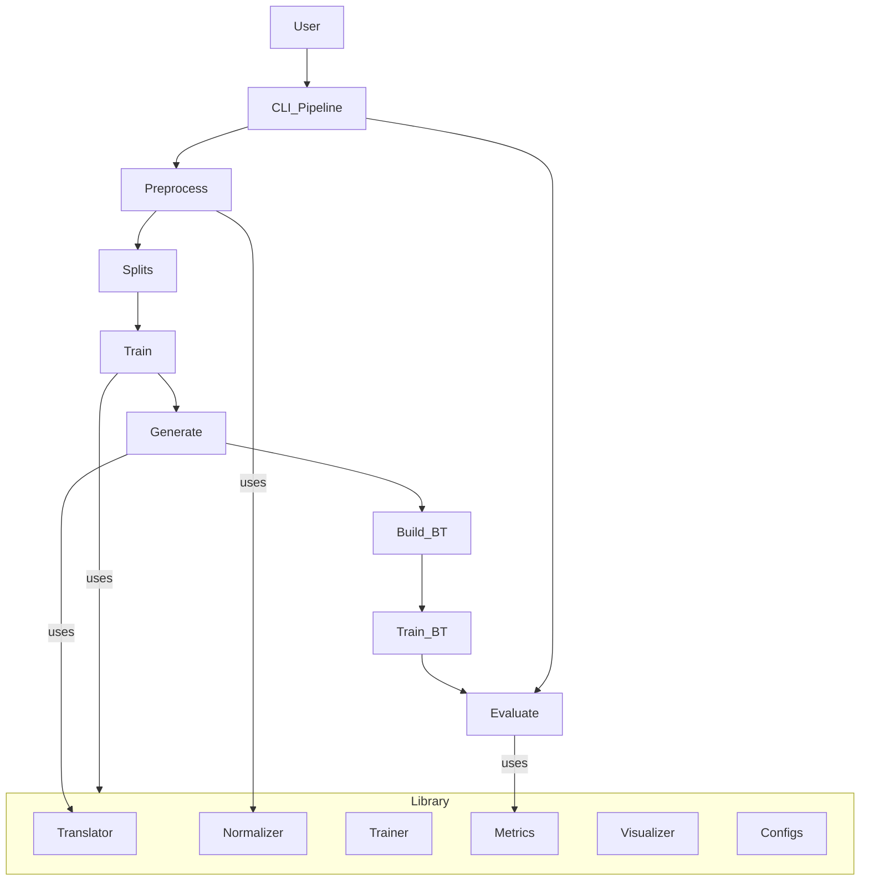

This diagram shows the CLI steps and their interaction with the library modules. Sources: [README.md](), [LIBRARY_GUIDE.md](), [grc_nmt.py]()

## Components and Goals

### CLI Pipeline (End-to-End)
- grc_nmt.py is the central CLI tool supporting:
  - preprocess with normalization
  - make_splits with optional author/work-level splits
  - train for grc2en and en2grc
  - generate for translation/back-translation
  - build_bt for synthetic bitext
  - evaluate for SacreBLEU and chrF. Sources: [README.md](), [grc_nmt.py]()

Goals:
- Provide strong defaults for mBART-50, auto-guessing language token codes when omitted. Sources: [README.md]()
- Support NLLB-200 language codes and Marian alternatives. Sources: [README.md](), [grc_nmt_opus.py]()

### Library Modules (Educational and Extensible)
- core/translator.py: main translation interface for model loading, tokenization, and decoding strategies. Sources: [LIBRARY_GUIDE.md]()
- preprocessing/normalizer.py: Ancient Greek normalization (diacritics handling, sigma normalization, Unicode). Sources: [LIBRARY_GUIDE.md]()
- training/trainer.py: training pipeline with hyperparameter explanations and AMP/distributed training. Sources: [LIBRARY_GUIDE.md]()
- evaluation/metrics.py: BLEU, chrF, METEOR, BERTScore, and Ancient Greek specific ideas. Sources: [LIBRARY_GUIDE.md](), [ancient_greek_nmt/evaluation/metrics.py]()
- utils/visualizer.py: attention/training curves and error analysis. Sources: [LIBRARY_GUIDE.md]()
- configs/config.py: centralized configuration with presets and YAML/JSON support. Sources: [LIBRARY_GUIDE.md]()

The library aims at modularity, documentation, and visualization for students, researchers, and practitioners. Sources: [LIBRARY_GUIDE.md]()

## Supported Models and Language Codes
- Default: mBART‑50 many‑to‑many: el_GR (Greek script), en_XX (English). Ancient Greek isn’t a separate code; script‑level tokenization is used. Sources: [README.md]()
- NLLB‑200: e.g., facebook/nllb-200-distilled-600M, codes ell_Grek (Greek script), eng_Latn (English). Sources: [README.md]()
- Marian baselines via OPUS: Helsinki-NLP/opus-mt-* with a reference pipeline in grc_nmt_opus.py. Sources: [README.md](), [grc_nmt_opus.py]()

Troubleshooting and performance tips include length penalty, no-repeat ngrams, sampling, token code specification, and OOM mitigations. Sources: [README.md]()

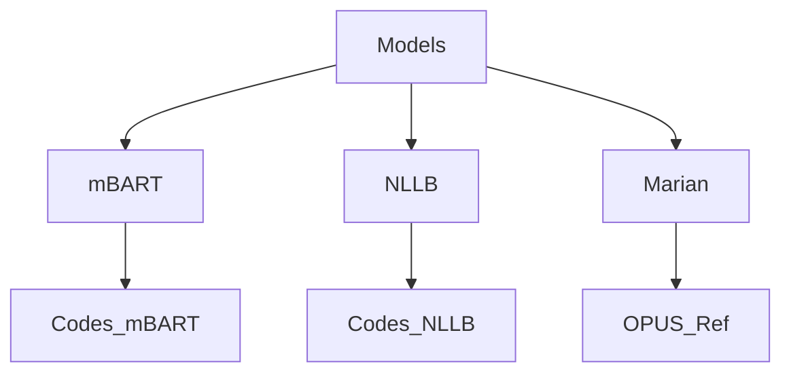

This diagram summarizes supported model families and code considerations. Sources: [README.md](), [grc_nmt_opus.py]()

## Data Processing and Normalization

### Preprocessing Goals
- Normalize NFC, unify punctuation/quotes, map final sigma ς→σ mid-word, optional diacritics stripping, optional lowercasing. Sources: [README.md](), [grc_nmt.py]()
- Keep two corpora variants if desired (with/without diacritics). Sources: [README.md](), [grc_nmt_opus.py]()

The CLI preprocess step outputs JSONL with src/tgt pairs; monolingual normalization is supported for back-translation preparation. Sources: [grc_nmt.py](), [grc_nmt_opus.py]()

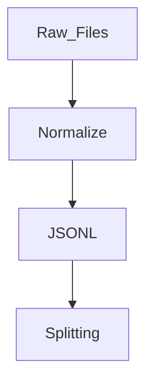

A minimal flow from raw text to normalized JSONL. Sources: [grc_nmt.py](), [grc_nmt_opus.py]()

Example usage in scripts shows text normalization before translation. Sources: [examples/basic_translation.py](), [examples/README.md]()

## Training, Generation, and Evaluation

### Training
- Uses Transformers for fine-tuning; direction parameter controls grc2en or en2grc. Sources: [README.md](), [grc_nmt.py]()
- Key options: num_epochs, lr, batch, grad_accum, language token codes, forced_bos_lang. Sources: [README.md](), [grc_nmt.py]()

### Generation and Back-Translation
- generate: translate monolingual text to create synthetic data; supports beams and max tokens. Sources: [README.md](), [grc_nmt.py]()
- build_bt: pairs source with synthetic target for training EN→GRC. Sources: [README.md](), [grc_nmt.py]()

### Evaluation
- evaluate: computes SacreBLEU and chrF on test JSONL. Sources: [README.md](), [grc_nmt.py]()
- Metrics library documents BLEU, chrF, METEOR, BERTScore, and custom Ancient Greek checks. Sources: [ancient_greek_nmt/evaluation/metrics.py](), [LIBRARY_GUIDE.md]()

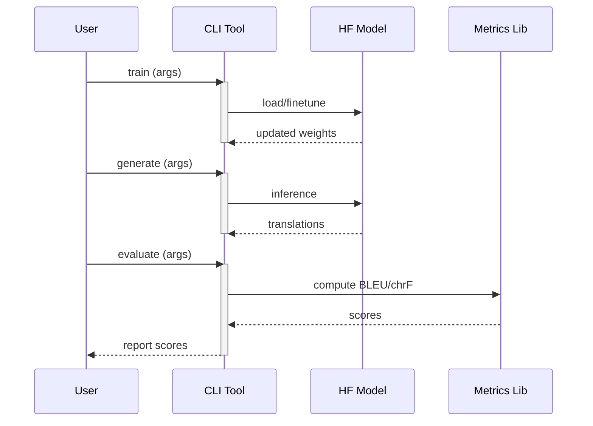

Sequence of core interactions during train, generate, and evaluate. Sources: [README.md](), [grc_nmt.py](), [ancient_greek_nmt/evaluation/metrics.py]()

## Commands and Options

### Core CLI Tasks and Typical Arguments

| Task | Command excerpt | Key options |
|---|---|---|
| Preprocess | python grc_nmt.py preprocess | --src_file, --tgt_file, --out_jsonl, --lang, --keep_diacritics, --lowercase |
| Make splits | python grc_nmt.py make_splits | --bitext, --train, --dev, --test, --split_by_meta |
| Train (mBART) | python grc_nmt.py train | --train_jsonl, --dev_jsonl, --direction, --model_name, --save_dir, --num_epochs, --lr, --batch, --grad_accum, --src_lang_tok_code, --tgt_lang_tok_code, --forced_bos_lang |
| Generate | python grc_nmt.py generate | --model_dir, --in_txt, --out_txt, --src_lang, --tgt_lang, --num_beams, --max_new_tokens, --src_lang_tok_code, --tgt_lang_tok_code, --forced_bos_lang |
| Build BT | python grc_nmt.py build_bt | --source_txt, --synthetic_txt, --out_jsonl, --direction |
| Evaluate | python grc_nmt.py evaluate | --model_dir, --test_jsonl, --src_lang, --tgt_lang, --src_lang_tok_code, --tgt_lang_tok_code |

Sources: [README.md](), [grc_nmt.py]()

### Console Entry Points

| Script | Entry point | Purpose |
|---|---|---|
| ancient-greek-translate | ancient_greek_nmt.cli:main | Translation CLI (package entry) |
| ancient-greek-train | ancient_greek_nmt.cli:train | Training CLI (package entry) |
| ancient-greek-evaluate | ancient_greek_nmt.cli:evaluate | Evaluation CLI (package entry) |

Sources: [setup.py]()

## Installation and Dependencies

Install via requirements or package extras:
- python -m pip install -r requirements.txt (pipeline)
- pip install -e . (library, development layout)
- Extras: visualization, notebook, development, all. Sources: [README.md](), [LIBRARY_GUIDE.md](), [setup.py]()

Core dependencies include transformers, datasets, accelerate, torch, sacrebleu, ftfy, regex, numpy, pandas, tqdm, pyyaml. Sources: [setup.py]()

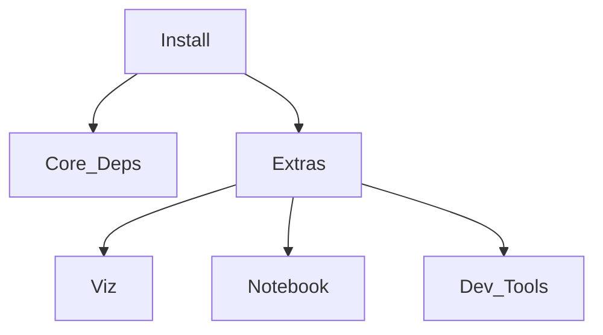

Dependency groups as defined in setup extras. Sources: [setup.py]()

## Examples, Notebooks, and Learning Resources

- Notebook: notebooks/grc_en_demo.ipynb demonstrates an end-to-end toy run; paths relative to grc_nmt.py. Sources: [README.md]()
- Library tutorial: notebooks/ancient_greek_translation_tutorial.ipynb for step-by-step explanations and visualizations. Sources: [LIBRARY_GUIDE.md]()
- Example scripts: basic translation, batch processing, advanced features, text preprocessing, training. Sources: [examples/README.md]()
- The basic_translation.py example normalizes and translates famous Greek lines using the Translator and GreekNormalizer. Sources: [examples/basic_translation.py]()

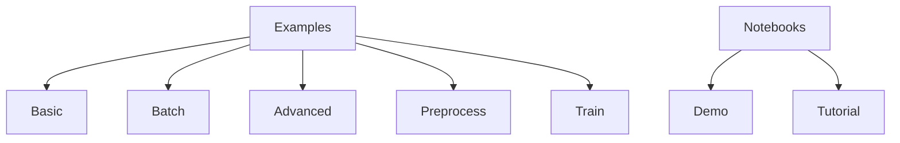

Learning assets organization for quick onboarding. Sources: [examples/README.md](), [README.md](), [LIBRARY_GUIDE.md]()

## Evaluation Metrics

The evaluation module provides:
- BLEU and chrF as primary metrics for reporting.
- Documentation referencing METEOR, BERTScore, and custom Ancient Greek checks (e.g., case agreement) for extended analysis.
- A dataclass container for metrics and utility methods for summaries. Sources: [ancient_greek_nmt/evaluation/metrics.py](), [README.md](), [LIBRARY_GUIDE.md]()

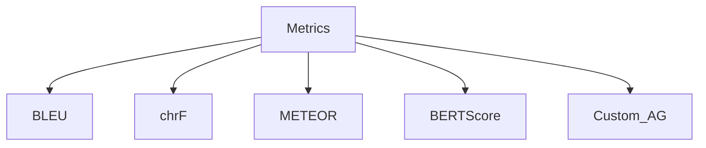

Overview of available and referenced metrics. Sources: [ancient_greek_nmt/evaluation/metrics.py](), [LIBRARY_GUIDE.md](), [README.md]()

## Back-Translation Workflow

- Train GRC→EN.
- Generate synthetic GRC from monolingual EN.
- Build synthetic bitext and mix with real data.
- Train EN→GRC on combined data. Sources: [README.md]()

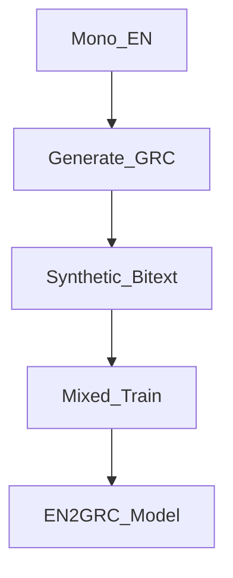

The back-translation flow mirrors the recommended steps in the pipeline. Sources: [README.md]()

## Best Practices and Troubleshooting

- Keep author/work-level splits to avoid leakage; report scores by register/dialect; optionally include round-trip chrF. Sources: [README.md]()
- Normalization: NFC, unify punctuation, mid-word ς→σ, optional diacritics stripping; consider domain tags as prefix tokens. Sources: [README.md]()
- Troubleshooting: adjust no_repeat_ngram_size, length penalty, sampling; set tokenizer codes; manage memory via batch/grad accumulation/max length; try smaller parent models. Sources: [README.md]()

## Code Snippets

Example: Basic translation with normalization using the library.

```python
from ancient_greek_nmt.core.translator import Translator
from ancient_greek_nmt.preprocessing.normalizer import GreekNormalizer

translator = Translator(model_name="facebook/mbart-large-50-many-to-many-mmt")
normalizer = GreekNormalizer(keep_diacritics=True, lowercase=True, normalize_sigma=True)
english = translator.translate(normalizer.normalize("οἱ παῖδες ἐν τῇ οἰκίᾳ εἰσίν"))
```

Sources: [LIBRARY_GUIDE.md](), [examples/basic_translation.py]()

Example: CLI training and evaluation (toy run).

```bash
python grc_nmt.py train \
  --train_jsonl data/train.jsonl --dev_jsonl data/dev.jsonl \
  --direction grc2en \
  --model_name facebook/mbart-large-50-many-to-many-mmt \
  --save_dir runs/grc2en.mbart \
  --num_epochs 1 --lr 5e-5 --batch 4 \
  --src_lang_tok_code el_GR --tgt_lang_tok_code en_XX --forced_bos_lang en_XX

python grc_nmt.py evaluate \
  --model_dir runs/grc2en.mbart \
  --test_jsonl data/test.jsonl \
  --src_lang grc --tgt_lang en \
  --src_lang_tok_code el_GR --tgt_lang_tok_code en_XX
```

Sources: [README.md]()

## Summary

This project unifies a practical Ancient Greek ↔ English NMT pipeline with an educational, modular library. The CLI enables end-to-end workflows (preprocess, split, train, generate, back-translate, evaluate), while the library provides documented components for translation, normalization, training, metrics, visualization, and configuration. Model flexibility (mBART/NLLB/Marian), robust evaluation (BLEU/chrF), and clear examples support both experimentation and learning. Sources: [README.md](), [LIBRARY_GUIDE.md](), [grc_nmt.py](), [ancient_greek_nmt/evaluation/metrics.py](), [examples/README.md]()

---

<a id='page-2'></a>

## System Architecture Overview

### Related Pages

Related topics: [Data Pipeline and Normalization Flow](#page-3), [Training and Evaluation Workflow](#page-4), [Model Integration: mBART, NLLB, Marian](#page-5)

<details>
<summary>Relevant source files</summary>

The following files were used as context for generating this wiki page:

- [grc_nmt.py](https://github.com/briefcasebrain/ancient-greek-nmt/blob/main/grc_nmt.py)
- [grc_nmt_opus.py](https://github.com/briefcasebrain/ancient-greek-nmt/blob/main/grc_nmt_opus.py)
- [README.md](https://github.com/briefcasebrain/ancient-greek-nmt/blob/main/README.md)
- [LIBRARY_GUIDE.md](https://github.com/briefcasebrain/ancient-greek-nmt/blob/main/LIBRARY_GUIDE.md)
- [examples/README.md](https://github.com/briefcasebrain/ancient-greek-nmt/blob/main/examples/README.md)
- [ancient_greek_nmt/evaluation/metrics.py](https://github.com/briefcasebrain/ancient-greek-nmt/blob/main/ancient_greek_nmt/evaluation/metrics.py)
- [setup.py](https://github.com/briefcasebrain/ancient-greek-nmt/blob/main/setup.py)
</details>

# System Architecture Overview

The project provides an end-to-end pipeline for training and evaluating Ancient Greek ↔ English neural machine translation (NMT). The core workflow is implemented as a single CLI-oriented script that performs preprocessing, dataset splitting, fine-tuning (mBART/NLLB/Marian), generation/back-translation, and evaluation, with documented defaults and usage examples. Sources: [README.md](), [grc_nmt.py](), [grc_nmt_opus.py]()

In addition to the pipeline scripts, the documentation describes a modular library layout (translator, preprocessing, models, training, evaluation, visualization, configs) designed for educational and research use, alongside examples and optional CLI entry points declared in packaging metadata. Sources: [LIBRARY_GUIDE.md](), [examples/README.md](), [setup.py]()

## High-Level Architecture

The system centers on a CLI-driven pipeline with six major stages: preprocess, split, train, generate, build back-translation, and evaluate. The default path uses mBART-50; an OPUS/Marian variant is also provided. Sources: [README.md](), [grc_nmt.py](), [grc_nmt_opus.py]()

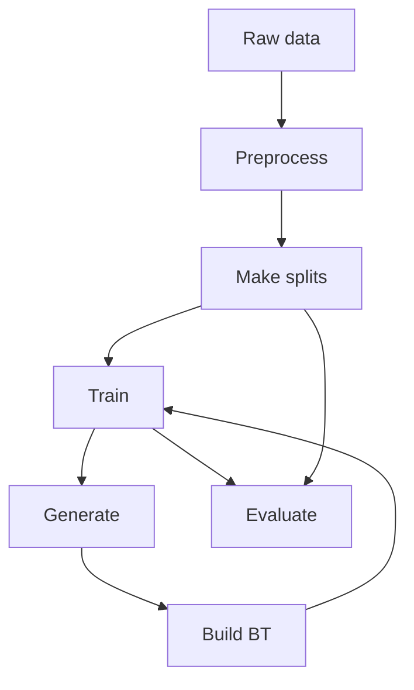
This diagram shows the top-down data flow: raw text is normalized, split, used to fine-tune a model, optionally used to produce synthetic data for back-translation (BT), and finally evaluated. Sources: [README.md](), [grc_nmt.py](), [grc_nmt_opus.py]()

## Core Pipelines

### mBART/NLLB Pipeline (grc_nmt.py)
- Provides CLI commands: preprocess, make_splits, train, generate, build_bt, evaluate. Defaults target mBART-50; supports switching to NLLB via flags. Sources: [grc_nmt.py](), [README.md]()
- Example commands include explicit language token codes (mBART: el_GR, en_XX) and generation parameters for back-translation workflows. Sources: [README.md](), [grc_nmt.py]()

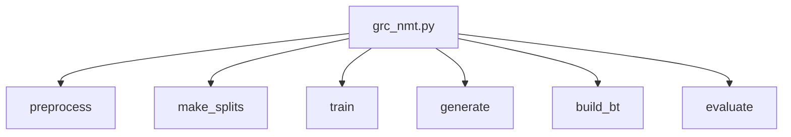
The mBART/NLLB pipeline exposes six subcommands that map to end-to-end steps. Sources: [grc_nmt.py](), [README.md]()

### OPUS/Marian Pipeline (grc_nmt_opus.py)
- Mirrors the end-to-end flow with Marian defaults (e.g., Helsinki-NLP/opus-mt-*), including the same subcommands and back-translation support. Sources: [grc_nmt_opus.py](), [README.md]()

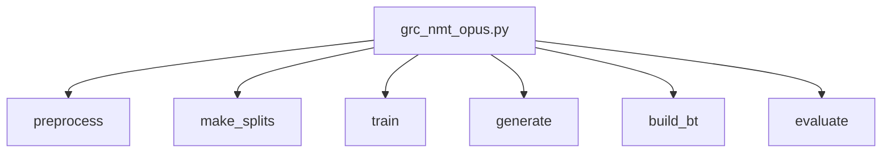
The OPUS variant is a reference with Marian defaults while keeping the same CLI workflow. Sources: [grc_nmt_opus.py](), [README.md]()

## Command-Line Interface and Data Flow

### Subcommands and Key Options
The CLI in grc_nmt.py defines subcommands with options directly in the argument parser, covering preprocessing, splitting, and training (selected options shown below). Sources: [grc_nmt.py]()

- preprocess
  - --src_file, --tgt_file, --out_jsonl, --lang [src_grc|src_en|grc|en], --keep_diacritics, --lowercase. Sources: [grc_nmt.py]()
- make_splits
  - --bitext, --train, --dev, --test, --split_by_meta, --seed. Sources: [grc_nmt.py]()
- train
  - --train_jsonl (multiple), --dev_jsonl, --direction [grc2en|en2grc], --model_name, --save_dir, --num_epochs, --lr, --batch, --grad_accum, --bf16, --max_src_len, --max_tgt_len. Sources: [grc_nmt.py]()

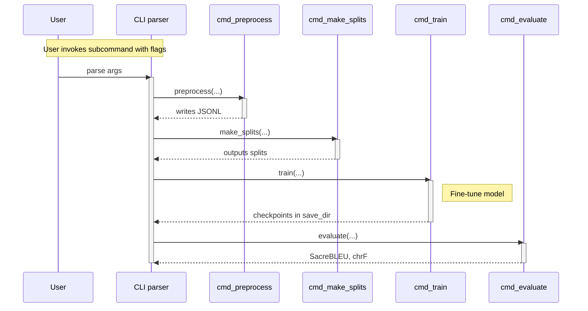
This sequence illustrates the control flow from user invocation through the subcommand-specific handlers. Sources: [grc_nmt.py]()

### Normalization and Preprocessing
- Preprocessing normalizes Ancient Greek and English with NFC normalization, optional lowercasing, final-sigma mapping, punctuation unification, and optional diacritics stripping. Sources: [grc_nmt_opus.py]()
- Example normalization helper (English) shows ftfy correction, Unicode NFC, punctuation mapping, optional lowercasing, and whitespace normalization. Sources: [grc_nmt_opus.py]()

```python
# grc_nmt_opus.py
def norm_english(text: str, lowercase: bool = False) -> str:
    t = fix_text(text)
    t = ud.normalize("NFC", t)
    t = "".join(PUNCT_MAP.get(ch, ch) for ch in t)
    if lowercase:
        t = t.lower()
    t = WHITESPACE_RE.sub(" ", t).strip()
    return t
```
Used in preprocess to transform source/target lines prior to JSONL emission. Sources: [grc_nmt_opus.py]()

### Dataset Splitting
- Splitting can be random by line or grouped by metadata file (TSV with id, work, author) to enforce leakage-free author/work-level splits. Sources: [grc_nmt_opus.py](), [grc_nmt.py]()

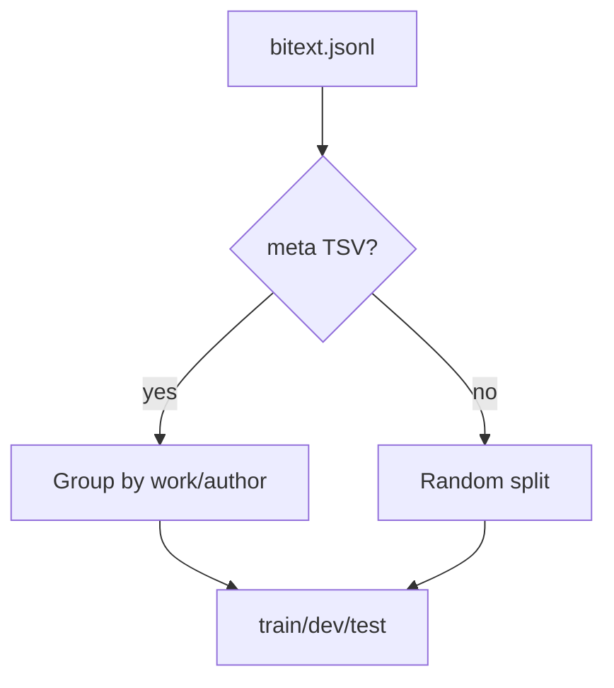
The split logic supports optional metadata for discipline-aligned evaluation. Sources: [grc_nmt_opus.py](), [grc_nmt.py]()

### Training
- mBART default model: facebook/mbart-large-50-many-to-many-mmt; directions grc2en or en2grc; configurable hyperparameters and token language codes (e.g., el_GR, en_XX). Sources: [grc_nmt.py](), [README.md]()
- OPUS defaults: e.g., Helsinki-NLP/opus-mt-mul-en for grc2en, Helsinki-NLP/opus-mt-en-mul for en2grc. Sources: [grc_nmt_opus.py]()

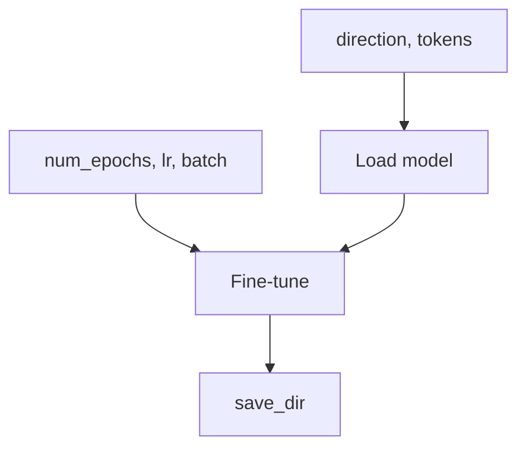
Training consumes configuration from CLI flags and persists to the save directory. Sources: [grc_nmt.py](), [grc_nmt_opus.py]()

### Generation and Back-Translation
- Generation supports translating monolingual input to produce synthetic data; usage examples include num_beams, max_new_tokens, and language token controls such as forced_bos_lang. Sources: [README.md](), [grc_nmt.py](), [grc_nmt_opus.py]()
- build_bt constructs synthetic bitext by pairing original monolingual lines with generated outputs for mixing with real parallel data in subsequent training. Sources: [README.md](), [grc_nmt.py](), [grc_nmt_opus.py]()

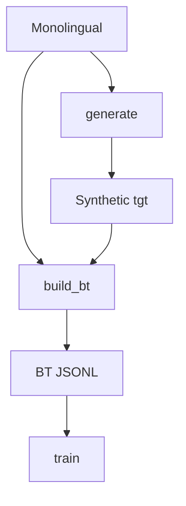
Back-translation augments training data for improved EN→GRC performance. Sources: [README.md](), [grc_nmt.py](), [grc_nmt_opus.py]()

### Evaluation
- Evaluation reports SacreBLEU and chrF by computing corpus scores over hypotheses and references. Sources: [grc_nmt.py](), [grc_nmt_opus.py](), [README.md]()

```python
# grc_nmt.py / grc_nmt_opus.py (pattern)
bleu = sacrebleu.corpus_bleu(hyps, refs)
chrf = sacrebleu.corpus_chrf(hyps, refs)
print("SacreBLEU:", bleu.format())
print("chrF:", chrf.format())
```
The evaluation step aggregates decoded outputs and prints formatted metrics. Sources: [grc_nmt.py](), [grc_nmt_opus.py]()

## Model Switching and Language Codes

- Switching models: default mBART-50; NLLB-200 supported via model_name changes and language codes (mBART: el_GR, en_XX; NLLB: ell_Grek, eng_Latn). If src/tgt token codes are omitted, the script can auto-guess sensible codes based on model and direction (per documentation). Sources: [README.md]()
- OPUS/Marian variant leverages Helsinki-NLP models as a simpler baseline. Sources: [grc_nmt_opus.py](), [README.md]()

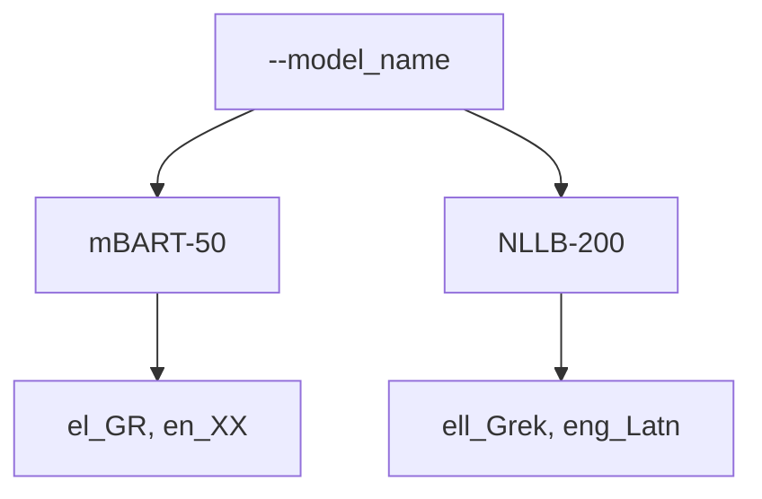
Model and language token configuration are controlled by CLI flags as shown in usage examples. Sources: [README.md]()

## Evaluation Metrics Module

The library’s metrics module documents and structures evaluation beyond the pipeline’s SacreBLEU and chrF, including METEOR, BERTScore, and custom Ancient Greek metrics. It defines a TranslationMetrics dataclass with fields, conversion, and summary helpers. Sources: [ancient_greek_nmt/evaluation/metrics.py]()

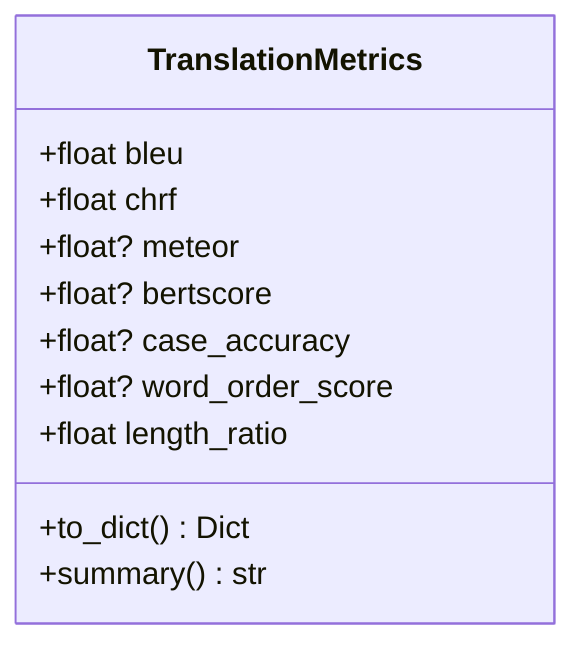
This diagram reflects the documented fields and convenience methods in the metrics container. Sources: [ancient_greek_nmt/evaluation/metrics.py]()

## Examples and Educational Layout

- The examples directory lists scripts that demonstrate basic translation, batch processing, advanced features (decoding/attention/confidence), preprocessing, and model training. Each script is runnable and notes optional dependencies for visualization and training. Sources: [examples/README.md]()
- The library guide describes a modular package layout (translator, normalizer, architectures, trainer, metrics, visualizer, configs), sample data, tutorial notebooks, and learning path. Sources: [LIBRARY_GUIDE.md]()

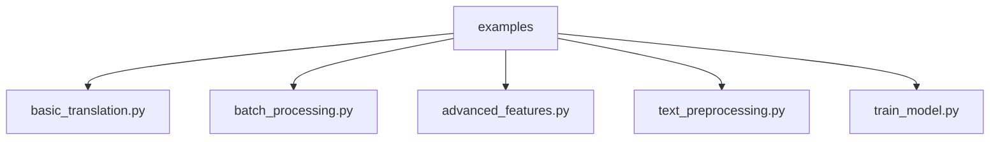
Examples are organized by task type and reference the main library installation. Sources: [examples/README.md](), [LIBRARY_GUIDE.md]()

## Installation, Packaging, and Entry Points

- Quick environment setup uses requirements.txt as per README; packaging metadata defines install_requires and extras (visualization, notebook, development, all). Sources: [README.md](), [setup.py]()
- setup.py configures console scripts:
  - ancient-greek-translate=ancient_greek_nmt.cli:main
  - ancient-greek-train=ancient_greek_nmt.cli:train
  - ancient-greek-evaluate=ancient_greek_nmt.cli:evaluate
  Sources: [setup.py]()

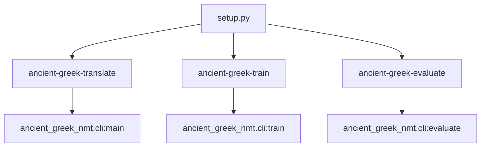
Entry points expose CLI commands from the packaged module. Sources: [setup.py]()

## Reference Tables

### Core Features and Components

| Component | Purpose | Implementation/Docs |
|---|---|---|
| Preprocess | Normalize text and emit JSONL | grc_nmt.py, grc_nmt_opus.py |
| Make splits | Train/dev/test with optional metadata grouping | grc_nmt.py, grc_nmt_opus.py |
| Train | Fine-tune seq2seq (mBART/NLLB/Marian) | grc_nmt.py, grc_nmt_opus.py |
| Generate | Translate or back-translate monolingual | grc_nmt.py, grc_nmt_opus.py, README.md |
| Build BT | Construct synthetic bitext | grc_nmt.py, grc_nmt_opus.py, README.md |
| Evaluate | SacreBLEU + chrF reporting | grc_nmt.py, grc_nmt_opus.py, README.md |
Sources: [grc_nmt.py](), [grc_nmt_opus.py](), [README.md]()

### Selected CLI Options (as defined)

| Subcommand | Option | Type/Notes |
|---|---|---|
| preprocess | --src_file | required |
| preprocess | --tgt_file | optional |
| preprocess | --out_jsonl | required |
| preprocess | --lang | choices: src_grc, src_en, grc, en |
| preprocess | --keep_diacritics | flag |
| preprocess | --lowercase | flag |
| make_splits | --bitext | required |
| make_splits | --train/--dev/--test | required paths |
| make_splits | --split_by_meta | optional TSV |
| make_splits | --seed | int |
| train | --train_jsonl | one or more |
| train | --dev_jsonl | required |
| train | --direction | choices: grc2en, en2grc |
| train | --model_name | default provided |
| train | --save_dir | required |
| train | --num_epochs/--lr/--batch/--grad_accum | hyperparams |
| train | --bf16 | flag |
| train | --max_src_len/--max_tgt_len | int |
Sources: [grc_nmt.py]()

### Model and Language Codes (documented examples)

| Model Family | Example Model | Token Codes |
|---|---|---|
| mBART‑50 | facebook/mbart-large-50-many-to-many-mmt | el_GR (Greek), en_XX (English) |
| NLLB‑200 | facebook/nllb-200-*, e.g., distilled-600M | ell_Grek (Greek script), eng_Latn (English) |
| Marian (OPUS) | Helsinki-NLP/opus-mt-mul-en, opus-mt-en-mul | N/A (no language codes) |
Sources: [README.md]()

### Packaging and Extras

| Category | Dependencies (partial) |
|---|---|
| Core | transformers, datasets, accelerate, torch, sacrebleu, ftfy, regex, numpy, pandas, tqdm, pyyaml |
| visualization | matplotlib, seaborn, plotly |
| notebook | jupyter, ipywidgets, notebook |
| development | pytest, pytest-cov, black, flake8, mypy, sphinx, sphinx-rtd-theme |
Sources: [setup.py]()

## Summary

The system is organized around a clear, CLI-driven NMT pipeline supporting preprocessing, leakage-aware splitting, training across popular multilingual models, synthetic data generation for back-translation, and standardized evaluation. Documentation and examples complement the pipeline with a broader educational library perspective and packaging that exposes optional entry points and extras. Sources: [README.md](), [grc_nmt.py](), [grc_nmt_opus.py](), [LIBRARY_GUIDE.md](), [examples/README.md](), [setup.py](), [ancient_greek_nmt/evaluation/metrics.py]()

---

<a id='page-3'></a>

## Data Pipeline and Normalization Flow

### Related Pages

Related topics: [System Architecture Overview](#page-2), [Training and Evaluation Workflow](#page-4), [Core Features and Commands](#page-7)

<details>
<summary>Relevant source files</summary>

The following files were used as context for generating this wiki page:

- [grc_nmt.py](https://github.com/briefcasebrain/ancient-greek-nmt/blob/main/grc_nmt.py)
- [grc_nmt_opus.py](https://github.com/briefcasebrain/ancient-greek-nmt/blob/main/grc_nmt_opus.py)
- [README.md](https://github.com/briefcasebrain/ancient-greek-nmt/blob/main/README.md)
- [LIBRARY_GUIDE.md](https://github.com/briefcasebrain/ancient-greek-nmt/blob/main/LIBRARY_GUIDE.md)
- [examples/README.md](https://github.com/briefcasebrain/ancient-greek-nmt/blob/main/examples/README.md)
- [examples/text_preprocessing.py](https://github.com/briefcasebrain/ancient-greek-nmt/blob/main/examples/text_preprocessing.py)
- [ancient_greek_nmt/evaluation/metrics.py](https://github.com/briefcasebrain/ancient-greek-nmt/blob/main/ancient_greek_nmt/evaluation/metrics.py)
- [setup.py](https://github.com/briefcasebrain/ancient-greek-nmt/blob/main/setup.py)
</details>

# Data Pipeline and Normalization Flow

## Introduction
This page describes the end-to-end data pipeline and normalization flow that powers Ancient Greek ↔ English neural machine translation in this project. It covers text normalization, dataset preparation, splitting, training, generation (including back-translation), and evaluation, as implemented in the command-line pipelines and exemplified in the repository’s documentation and examples. Sources: [grc_nmt.py](), [grc_nmt_opus.py](), [README.md]()

The pipeline is designed to be mBART/NLLB-ready with strong defaults, while also providing an OPUS/Marian variant. It emphasizes orthography-aware preprocessing for Ancient Greek (Unicode normalization, final-sigma handling, optional diacritics stripping), robust data splits, and evaluation with SacreBLEU and chrF. Sources: [grc_nmt.py](), [grc_nmt_opus.py](), [README.md]()

## High-Level Pipeline Overview
The command-line pipeline encapsulates six major stages: preprocess, make_splits, train, generate, build_bt (for back-translation), and evaluate. Each stage is implemented in the CLI script(s) and coordinated via subcommands. Sources: [grc_nmt.py](), [grc_nmt_opus.py](), [README.md]()

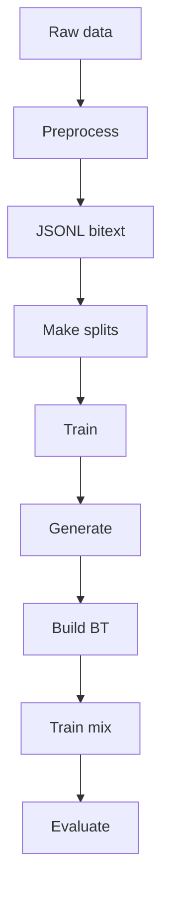
This flow reflects the documented commands and stages for dataset normalization, splitting, finetuning, inference/back-translation, and metrics computation. Sources: [README.md](), [grc_nmt.py](), [grc_nmt_opus.py]()

## Text Normalization

### Goals and Scope
Normalization ensures consistent Unicode form, punctuation, casing, sigma handling, whitespace, and optional diacritics handling for Ancient Greek; English normalization unifies punctuation and casing. These are used both for parallel and monolingual inputs during preprocessing. Sources: [grc_nmt.py](), [grc_nmt_opus.py]()

### Ancient Greek Normalization
- Unicode NFC normalization
- Punctuation unification via a mapping
- Final-sigma mapping (ς→σ) mid-word
- Optional diacritics stripping (configurable)
- Optional lowercasing
- Whitespace collapsing and trimming
These behaviors are described in the CLI docs and implemented in normalization helpers used by preprocess. Sources: [grc_nmt_opus.py](), [grc_nmt.py](), [README.md]()

```mermaid
graph TD
  A[Greek text] --> B[NFC normalize]
  B --> C[Punct unify]
  C --> D[Final sigma]
  D --> E[Lowercase?]
  E --> F[Strip diacritics?]
  F --> G[Collapse space]
  G --> H[Normalized]
```
Normalization steps applied to Greek text with optional lowercasing and diacritics stripping. Sources: [grc_nmt_opus.py](), [grc_nmt.py]()

### English Normalization
- ftfy fix_text
- Unicode NFC
- Punctuation unification via mapping
- Optional lowercasing
- Whitespace collapsing and trimming
These steps are implemented in a dedicated English normalization helper. Sources: [grc_nmt_opus.py](), [grc_nmt.py]()

Example implementation (English):
```python
# grc_nmt_opus.py / grc_nmt.py
def norm_english(text: str, lowercase: bool = False) -> str:
    t = fix_text(text)
    t = ud.normalize("NFC", t)
    t = "".join(PUNCT_MAP.get(ch, ch) for ch in t)
    if lowercase:
        t = t.lower()
    t = WHITESPACE_RE.sub(" ", t).strip()
    return t
```
Sources: [grc_nmt_opus.py](), [grc_nmt.py]()

### Example Integration in Examples
Examples demonstrate normalizers through imports for GreekNormalizer and EnglishNormalizer and show varied normalization configurations and step-by-step outputs. Sources: [examples/text_preprocessing.py](), [examples/README.md](), [LIBRARY_GUIDE.md]()

## Data Ingestion and JSONL Format

### Input/Output Helpers
- read_lines(path) → List[str]
- write_jsonl(path, rows) → JSON Lines with objects
- read_jsonl(path) → List[Dict]
These helper functions are used throughout preprocess and downstream stages. Sources: [grc_nmt_opus.py](), [grc_nmt.py]()

Code excerpt:
```python
def read_lines(path: str) -> List[str]:
    with open(path, "r", encoding="utf-8") as f:
        return [line.rstrip("\n") for line in f]

def write_jsonl(path: str, rows: Iterable[Dict]):
    os.makedirs(os.path.dirname(path), exist_ok=True)
    with open(path, "w", encoding="utf-8") as f:
        for r in rows:
            f.write(json.dumps(r, ensure_ascii=False) + "\n")

def read_jsonl(path: str) -> List[Dict]:
    with open(path, "r", encoding="utf-8") as f:
        return [json.loads(x) for x in f]
```
Sources: [grc_nmt_opus.py](), [grc_nmt.py]()

### JSONL Records
- Parallel: {"src": normalized_source, "tgt": normalized_target}
- Monolingual: {"src": normalized_text}
Preprocess builds these records from raw text files depending on the presence of a target file. Sources: [grc_nmt_opus.py](), [grc_nmt.py]()

```mermaid
graph TD
  A[Raw src] --> B[Normalize src]
  A2[Raw tgt] --> C[Normalize tgt]
  B --> D[JSONL row]
  C --> D
  D[{"src","tgt"}] --> E[Write JSONL]
```
Parallel path; if tgt is missing, JSONL rows contain only "src". Sources: [grc_nmt_opus.py](), [grc_nmt.py]()

## Preprocess Command

### Behavior
- Validates line counts for parallel files
- Applies language-specific normalization depending on --lang
- Writes JSONL output for bitext or monotext
Sources: [grc_nmt_opus.py](), [grc_nmt.py]()

### CLI Options (Preprocess)
| Option | Type | Default | Description | Source |
|---|---|---|---|---|
| --src_file | str | required | Source text file | [grc_nmt.py]() |
| --tgt_file | str | None | Target text file (optional) | [grc_nmt.py]() |
| --out_jsonl | str | required | Output JSONL path | [grc_nmt.py]() |
| --lang | enum | src_grc | One of [src_grc, src_en, grc, en] | [grc_nmt.py]() |
| --keep_diacritics | flag | False | Preserve Greek diacritics | [grc_nmt.py](), [grc_nmt_opus.py]() |
| --lowercase | flag | False | Lowercase text | [grc_nmt.py](), [grc_nmt_opus.py]() |

Sources: [grc_nmt.py](), [grc_nmt_opus.py]()

### Sequence of Operations
```mermaid
sequenceDiagram
  participant User
  participant CLI
  participant IO
  participant Norm
  participant JSONL
  User->>CLI: preprocess args
  CLI->>IO: read_lines(src/tgt)
  IO-->>CLI: lists of lines
  CLI->>Norm: normalize per lang +
  activate Norm
  Norm-->>CLI: normalized pairs
  deactivate Norm
  CLI->>JSONL: write_jsonl(rows)
  JSONL-->>CLI: file written
  CLI-->>User: summary output
  Note over Norm: NFC, punct, sigma, diacritics, case, whitespace
```
Sources: [grc_nmt.py](), [grc_nmt_opus.py]()

## Splitting Strategy

### Make Splits
- Loads JSONL bitext rows
- If metadata TSV provided, groups indices by work/author to avoid leakage; otherwise random by line
- Writes train/dev/test JSONL paths
Sources: [grc_nmt.py](), [grc_nmt_opus.py](), [README.md]()

```mermaid
graph TD
  A[Bitext JSONL] --> B[Load rows]
  B --> C[Group by meta]
  B --> D[Random split]
  C --> E[Shard 80/10/10]
  D --> E
  E --> F[Train JSONL]
  E --> G[Dev JSONL]
  E --> H[Test JSONL]
```
Metadata columns expected include id, work, author (TSV). Sources: [grc_nmt.py](), [grc_nmt_opus.py]()

### CLI Options (Make Splits)
| Option | Type | Default | Description | Source |
|---|---|---|---|---|
| --bitext | str | required | Input JSONL bitext | [grc_nmt.py]() |
| --train | str | required | Output train JSONL | [grc_nmt.py]() |
| --dev | str | required | Output dev JSONL | [grc_nmt.py]() |
| --test | str | required | Output test JSONL | [grc_nmt.py]() |
| --split_by_meta | str | None | TSV with id,work,author | [grc_nmt.py](), [grc_nmt_opus.py]() |
| --seed | int | 13 | Random seed | [grc_nmt.py]() |

Sources: [grc_nmt.py](), [grc_nmt_opus.py]()

## Training

### Direction and Models
- Direction: grc2en or en2grc
- Default mBART-50 many-to-many in grc_nmt.py (mBART/NLLB-ready)
- OPUS/Marian defaults available in grc_nmt_opus.py
Sources: [grc_nmt.py](), [grc_nmt_opus.py](), [README.md]()

### Tokenization and Language Codes (mBART/NLLB)
- Uses explicit language token codes such as el_GR and en_XX and forced_bos_lang as documented in usage examples
Sources: [README.md](), [grc_nmt.py]()

```mermaid
graph TD
  A[Train JSONL] --> B[Tokenize]
  B --> C[Train loop]
  C --> D[Save model]
```
Top-level training flow (model specifics are configured via CLI). Sources: [README.md](), [grc_nmt.py](), [grc_nmt_opus.py]()

### CLI Options (Training)
| Option | Type | Default | Description | Source |
|---|---|---|---|---|
| --train_jsonl | list[str] | required | One or more JSONL files (merged) | [grc_nmt.py]() |
| --dev_jsonl | str | required | Dev JSONL | [grc_nmt.py]() |
| --direction | enum | required | grc2en or en2grc | [grc_nmt.py]() |
| --model_name | str | mBART or OPUS defaults | Pretrained model | [grc_nmt.py](), [grc_nmt_opus.py](), [README.md]() |
| --save_dir | str | required | Output checkpoint dir | [grc_nmt.py](), [README.md]() |
| --num_epochs | int | example: 24 | Training epochs | [README.md]() |
| --lr | float | example: 5e-5 | Learning rate | [README.md]() |
| --batch | int | example: 64 | Batch size | [README.md]() |
| --grad_accum | int | example: 1 | Gradient accumulation | [README.md]() |
| --src_lang_tok_code | str | e.g., el_GR | Source token code | [README.md]() |
| --tgt_lang_tok_code | str | e.g., en_XX | Target token code | [README.md]() |
| --forced_bos_lang | str | e.g., en_XX | Forced BOS language | [README.md]() |

Sources: [grc_nmt.py](), [grc_nmt_opus.py](), [README.md]()

## Generation and Back-Translation

### Generate
- Loads model and tokenizer
- Encodes inputs with truncation and padding up to max_src_len
- Uses generate() with parameters: num_beams, max_new_tokens, length_penalty, no_repeat_ngram_size
- Decodes outputs and writes to text
Sources: [grc_nmt_opus.py](), [grc_nmt.py](), [README.md]()

```mermaid
graph TD
  A[In text] --> B[Tokenizer]
  B --> C[Model generate]
  C --> D[Decode text]
  D --> E[Write output]
```
Generation flow for translation or back-translation. Sources: [grc_nmt_opus.py](), [grc_nmt.py]()

### Build Back-Translated Bitext
- Pairs original monolingual source with synthetic translations into JSONL with direction tags
- Used to augment training data for the reverse direction
Sources: [README.md](), [grc_nmt.py]()

### CLI Options (Generate)
| Option | Type | Default | Description | Source |
|---|---|---|---|---|
| --model_dir | str | required | Trained model directory | [README.md]() |
| --in_txt | str | required | Source monolingual file | [README.md]() |
| --out_txt | str | required | Output synthetic file | [README.md]() |
| --src_lang | str | required | Source language | [README.md]() |
| --tgt_lang | str | required | Target language | [README.md]() |
| --num_beams | int | example: 5 | Beam size | [grc_nmt_opus.py](), [README.md]() |
| --max_new_tokens | int | e.g., 256 | Max decode length | [grc_nmt_opus.py](), [README.md]() |
| --length_penalty | float | configurable | Length penalty | [grc_nmt_opus.py]() |
| --no_repeat_ngram_size | int | configurable | N-gram repeat control | [grc_nmt_opus.py]() |

Sources: [grc_nmt_opus.py](), [README.md](), [grc_nmt.py]()

## Evaluation

### Metrics
- SacreBLEU (corpus_bleu)
- chrF (corpus_chrf)
These are computed over model hypotheses and references from JSONL test sets. Sources: [grc_nmt_opus.py](), [grc_nmt.py]()

The extended metrics module also documents additional metrics (METEOR, BERTScore, and custom Ancient Greek metrics) for broader evaluation scenarios. Sources: [ancient_greek_nmt/evaluation/metrics.py]()

```mermaid
graph TD
  A[Model hyps] --> C[SacreBLEU]
  B[References] --> C
  A --> D[chrF]
  B --> D
  C --> E[Report scores]
  D --> E
```
Evaluation flow with SacreBLEU and chrF. Sources: [grc_nmt_opus.py](), [grc_nmt.py](), [ancient_greek_nmt/evaluation/metrics.py]()

### CLI Options (Evaluate)
| Option | Type | Default | Description | Source |
|---|---|---|---|---|
| --model_dir | str | required | Trained model directory | [README.md]() |
| --test_jsonl | str | required | Test JSONL | [README.md]() |
| --src_lang | str | required | Source language | [README.md]() |
| --tgt_lang | str | required | Target language | [README.md]() |
| --src_lang_tok_code | str | e.g., el_GR | Source token code | [README.md]() |
| --tgt_lang_tok_code | str | e.g., en_XX | Target token code | [README.md]() |

Sources: [README.md](), [grc_nmt.py]()

## CLI and Packaging Surface

### Available Subcommands
- preprocess
- make_splits
- train
- generate
- build_bt
- evaluate
These commands are provided via the pipeline scripts; setup also exposes console scripts for the packaged library entry points. Sources: [grc_nmt.py](), [grc_nmt_opus.py](), [setup.py]()

### Example Workflows
Repository README provides full command examples for each stage, including token code usage for mBART/NLLB and the OPUS variant. Sources: [README.md]()

```mermaid
graph TD
  A[User] --> B[CLI cmd]
  B --> C[Stage impl]
  C --> D[Artifacts]
  D --> E[Next stage]
```
CLI orchestration from user commands to stage artifacts. Sources: [README.md](), [grc_nmt.py](), [grc_nmt_opus.py]()

## Examples and Educational Aids
- Example scripts show batching, preprocessing demos, and training runs, using the library’s normalizers and translator interfaces. Sources: [examples/README.md](), [examples/text_preprocessing.py]()
- Library guide outlines educational modules and extended components for preprocessing, training, evaluation, and visualization. Sources: [LIBRARY_GUIDE.md]()

## Summary
The data pipeline and normalization flow comprise a practical, end-to-end process for Ancient Greek ↔ English NMT: normalization to robust JSONL bitext/monotext, leakage-aware splits, configurable training for multiple model families, generation and back-translation, and evaluation via SacreBLEU and chrF. The implementation balances linguistic preprocessing (sigma, diacritics, punctuation) with modern NMT best practices and is documented through CLI examples and educational modules. Sources: [grc_nmt.py](), [grc_nmt_opus.py](), [README.md](), [ancient_greek_nmt/evaluation/metrics.py](), [examples/README.md](), [examples/text_preprocessing.py](), [LIBRARY_GUIDE.md](), [setup.py]()

---

<a id='page-4'></a>

## Training and Evaluation Workflow

### Related Pages

Related topics: [Data Pipeline and Normalization Flow](#page-3), [Model Integration: mBART, NLLB, Marian](#page-5), [Notebooks and Visualizations](#page-10)

<details>
<summary>Relevant source files</summary>

The following files were used as context for generating this wiki page:

- [grc_nmt.py](https://github.com/briefcasebrain/ancient-greek-nmt/blob/main/grc_nmt.py)
- [grc_nmt_opus.py](https://github.com/briefcasebrain/ancient-greek-nmt/blob/main/grc_nmt_opus.py)
- [ancient_greek_nmt/training/trainer.py](https://github.com/briefcasebrain/ancient-greek-nmt/blob/main/ancient_greek_nmt/training/trainer.py)
- [ancient_greek_nmt/evaluation/metrics.py](https://github.com/briefcasebrain/ancient-greek-nmt/blob/main/ancient_greek_nmt/evaluation/metrics.py)
- [README.md](https://github.com/briefcasebrain/ancient-greek-nmt/blob/main/README.md)
- [LIBRARY_GUIDE.md](https://github.com/briefcasebrain/ancient-greek-nmt/blob/main/LIBRARY_GUIDE.md)
- [examples/README.md](https://github.com/briefcasebrain/ancient-greek-nmt/blob/main/examples/README.md)
- [examples/train_model.py](https://github.com/briefcasebrain/ancient-greek-nmt/blob/main/examples/train_model.py)
- [ancient_greek_nmt/__init__.py](https://github.com/briefcasebrain/ancient-greek-nmt/blob/main/ancient_greek_nmt/__init__.py)
- [setup.py](https://github.com/briefcasebrain/ancient-greek-nmt/blob/main/setup.py)
</details>

# Training and Evaluation Workflow

The training and evaluation workflow provides an end-to-end process for Ancient Greek ↔ English neural machine translation. It includes data normalization, dataset splitting, fine-tuning multilingual sequence-to-sequence models, back-translation, and robust evaluation with BLEU and chrF. The workflow can be executed via a single CLI script (mBART/NLLB default) or an OPUS/Marian reference variant, and it is complemented by a modular training library and evaluation utilities. Sources: [README.md](), [grc_nmt.py](), [grc_nmt_opus.py](), [ancient_greek_nmt/training/trainer.py](), [ancient_greek_nmt/evaluation/metrics.py](), [LIBRARY_GUIDE.md]()

The project exposes both script-based pipelines and a packaged API with training and metrics modules, plus example scripts and notebooks to demonstrate small runs and configuration options. Sources: [README.md](), [LIBRARY_GUIDE.md](), [examples/README.md](), [examples/train_model.py](), [ancient_greek_nmt/__init__.py]()

## Overview and Data Flow
Sources: [README.md](), [grc_nmt.py](), [grc_nmt_opus.py]()

The high-level pipeline is:
- Preprocess and normalize parallel or monolingual data to JSONL
- Make splits (train/dev/test), optionally by metadata
- Train direction-specific models (grc2en or en2grc)
- Generate back-translations for data augmentation
- Build synthetic parallel data
- Retrain with mixed real + synthetic data
- Evaluate on held-out test sets using SacreBLEU and chrF. Sources: [README.md](), [grc_nmt.py](), [grc_nmt_opus.py]()

```mermaid
graph TD
  A[Raw data] --> B[Preprocess]
  B --> C[Make splits]
  C --> D[Train grc→en]
  D --> E[Generate EN mono→GRC]
  E --> F[Build synthetic]
  F --> G[Train en→grc]
  D --> H[Evaluate grc→en]
  G --> I[Evaluate en→grc]
```
This diagram reflects the CLI examples for preprocess, make_splits, train, generate, build_bt, and evaluate. Sources: [README.md](), [grc_nmt.py](), [grc_nmt_opus.py]()

## CLI Pipeline (mBART/NLLB and OPUS variants)
Sources: [grc_nmt.py](), [grc_nmt_opus.py](), [README.md]()

### Commands
- preprocess: Normalize text and write JSONL (src/tgt columns or src-only for monolingual)
- make_splits: Split bitext into train/dev/test; supports metadata-based work/author-level splits
- train: Fine-tune seq2seq model with direction-specific language token settings
- generate: Translate or back-translate text
- build_bt: Construct synthetic bitext from monolingual + generated outputs
- evaluate: Report SacreBLEU and chrF on test JSONL. Sources: [grc_nmt.py](), [grc_nmt_opus.py](), [README.md]()

```mermaid
graph TD
  P[CLI user] --> Q[grc_nmt.py]
  Q --> R[preprocess]
  Q --> S[make_splits]
  Q --> T[train]
  Q --> U[generate]
  Q --> V[build_bt]
  Q --> W[evaluate]
```
Commands are documented with example invocation blocks in both mBART/NLLB and OPUS scripts. Sources: [grc_nmt.py](), [grc_nmt_opus.py](), [README.md]()

### Key Arguments (selected)
| Command      | Argument                       | Description |
|--------------|--------------------------------|-------------|
| preprocess   | --src_file, --tgt_file         | Input text files (parallel or monolingual) |
| preprocess   | --out_jsonl                    | Output JSONL with normalized text |
| preprocess   | --lang, --keep_diacritics, --lowercase | Normalization options (Ancient Greek handling) |
| make_splits  | --bitext, --train, --dev, --test | Input bitext and output split files |
| make_splits  | --split_by_meta                | Optional TSV for author/work-level splits |
| train        | --direction, --model_name, --save_dir | Direction, model identity, and output directory |
| train        | --num_epochs, --lr, --batch, --grad_accum | Core hyperparameters |
| train        | --src_lang_tok_code, --tgt_lang_tok_code, --forced_bos_lang | Language tokenization specifics |
| generate     | --in_txt, --out_txt            | Batch translate/back-translate text files |
| generate     | --num_beams, --max_new_tokens  | Decoding controls |
| evaluate     | --test_jsonl, --src_lang, --tgt_lang | Dataset and language direction |
| evaluate     | --src_lang_tok_code, --tgt_lang_tok_code | Token codes for evaluation. |
Sources: [grc_nmt.py](), [grc_nmt_opus.py](), [README.md]()

### Model Families and Language Codes
- mBART-50 default (facebook/mbart-large-50-many-to-many-mmt): el_GR (Greek script), en_XX (English) with forced_bos_lang for target
- NLLB-200 (facebook/nllb-200-*): ell_Grek (Greek script), eng_Latn (English)
- Marian (OPUS) variants referenced in grc_nmt_opus.py. Sources: [README.md](), [grc_nmt.py](), [grc_nmt_opus.py]()

## Training Module (Library)
Sources: [ancient_greek_nmt/training/trainer.py](), [LIBRARY_GUIDE.md](), [examples/train_model.py](), [examples/README.md](), [ancient_greek_nmt/__init__.py]()

The packaged training module provides:
- TrainingConfig: dataclass encapsulating model, data paths, and hyperparameters (e.g., model_name, direction, train_data/dev_data/test_data, learning_rate, batch_size, gradient_accumulation_steps, num_epochs, warmup_steps, weight_decay)
- NMTTrainer: integration with Hugging Face Transformers (AutoTokenizer, AutoModelForSeq2SeqLM, DataCollatorForSeq2Seq, Seq2SeqTrainingArguments, Seq2SeqTrainer, EarlyStoppingCallback), and datasets.Dataset
- Metrics during training via sacrebleu (as imported in the module). Sources: [ancient_greek_nmt/training/trainer.py]()

```mermaid
classDiagram
  class TrainingConfig {
    +model_name
    +direction
    +train_data
    +dev_data
    +test_data
    +learning_rate
    +batch_size
    +gradient_accumulation_steps
    +num_epochs
    +warmup_steps
    +weight_decay
  }
  class NMTTrainer
  class HF_Tokenizer as "AutoTokenizer"
  class HF_Model as "AutoModelForSeq2SeqLM"
  class HF_Collator as "DataCollatorForSeq2Seq"
  class HF_Args as "Seq2SeqTrainingArguments"
  class HF_Trainer as "Seq2SeqTrainer"

  NMTTrainer --> TrainingConfig
  NMTTrainer --> HF_Tokenizer
  NMTTrainer --> HF_Model
  NMTTrainer --> HF_Collator
  NMTTrainer --> HF_Args
  NMTTrainer --> HF_Trainer
```
This diagram reflects the imports and dataclass fields present in the module. Sources: [ancient_greek_nmt/training/trainer.py]()

```mermaid
sequenceDiagram
  participant Dev
  participant Trainer as NMTTrainer
  participant HF as HF Trainer
  participant DS as Dataset
  participant SB as sacrebleu
  Note over Dev,Trainer: Configure TrainingConfig
  Dev->>Trainer: init(config)
  activate Trainer
  Trainer->>HF: build tokenizer/model
  Trainer->>DS: load datasets
  Trainer->>HF: configure arguments
  Trainer->>HF: start training
  activate HF
  HF-->>Trainer: logs/metrics
  deactivate HF
  Trainer->>SB: compute BLEU/chrF
  SB-->>Trainer: scores
  Trainer-->>Dev: model/checkpoints/metrics
  deactivate Trainer
```
This sequence illustrates the library-level training flow combining Hugging Face tooling and sacrebleu, as indicated by imports and responsibilities. Sources: [ancient_greek_nmt/training/trainer.py]()

### Example Usage (Library)
```python
from ancient_greek_nmt.training.trainer import NMTTrainer, TrainingConfig

config = TrainingConfig(
    model_name="facebook/mbart-large-50-many-to-many-mmt",
    direction="grc2en",
    num_epochs=10,
    batch_size=8,
    learning_rate=3e-5,
    warmup_steps=100,
    gradient_accumulation_steps=1
)
trainer = NMTTrainer(config)
# trainer.train(...) / trainer.evaluate(...), etc.
```
Derived from the example training script generation and usage snippets. Sources: [examples/train_model.py](), [examples/README.md]()

## Evaluation Metrics
Sources: [ancient_greek_nmt/evaluation/metrics.py](), [README.md]()

The evaluation module documents and structures multiple metrics for translation quality:
- BLEU (0–100), n-gram precision focus
- chrF (0–100), character-level, suitable for morphologically rich languages
- METEOR (0–1), optional
- BERTScore (0–1), optional
- Custom Ancient Greek-aware aspects (e.g., case agreement) noted conceptually
A TranslationMetrics dataclass aggregates these, with optional fields and a to_dict/summary interface. Sources: [ancient_greek_nmt/evaluation/metrics.py]()

```mermaid
classDiagram
  class TranslationMetrics {
    +bleu: float
    +chrf: float
    +meteor: Optional[float]
    +bertscore: Optional[float]
    +case_accuracy: Optional[float]
    +word_order_score: Optional[float]
    +length_ratio: float
    +to_dict()
    +summary()
  }
```
Summarizes the dataclass and its methods as defined. Sources: [ancient_greek_nmt/evaluation/metrics.py]()

### Metrics Summary Table
| Metric       | Range | Notes |
|--------------|-------|-------|
| BLEU         | 0–100 | n-gram precision between candidate and reference |
| chrF         | 0–100 | character-level F-score; suitable for Ancient Greek morphology |
| METEOR       | 0–1   | considers synonyms, stemming, and word order (optional) |
| BERTScore    | 0–1   | embedding-based semantic similarity (optional) |
| case_accuracy | n/a  | custom metric concept (optional) |
| word_order_score | n/a | custom metric concept (optional) |
| length_ratio | n/a  | auxiliary ratio for length comparison |
Sources: [ancient_greek_nmt/evaluation/metrics.py](), [README.md]()

## Back-Translation Workflow
Sources: [README.md](), [grc_nmt.py](), [grc_nmt_opus.py]()

- Train a grc→en model
- Generate synthetic Greek from English monolingual input (EN→GRC)
- Build synthetic bitext and mix with real parallel data
- Train en→grc with combined data. Sources: [README.md](), [grc_nmt.py](), [grc_nmt_opus.py]()

```mermaid
graph TD
  A[Train grc→en] --> B[EN mono]
  B --> C[Generate GRC]
  C --> D[Build bitext]
  D --> E[Train en→grc]
```
This mirrors the documented “generate” and “build_bt” steps and the subsequent training call. Sources: [README.md](), [grc_nmt.py](), [grc_nmt_opus.py]()

## Language Tokenization and Normalization
Sources: [README.md](), [grc_nmt.py](), [grc_nmt_opus.py](), [LIBRARY_GUIDE.md]()

- Normalization includes NFC, punctuation unification, final-sigma mapping, optional diacritics stripping/retention, and optional lowercasing; Greek vs English paths are handled in the OPUS script; mBART/NLLB flow uses analogous normalization during preprocess. Sources: [grc_nmt_opus.py](), [grc_nmt.py]()
- Language token codes:
  - mBART-50: el_GR (Greek script), en_XX (English)
  - NLLB-200: ell_Grek (Greek script), eng_Latn (English)
  Set via --src_lang_tok_code, --tgt_lang_tok_code, and optionally --forced_bos_lang. Sources: [README.md](), [grc_nmt.py]()

```mermaid
graph TD
  A[Raw Greek] --> B[Normalize]
  A2[Raw English] --> B
  B --> C[Tokenize]
  C --> D[Train/Gen]
```
Normalization precedes tokenization and model operations. Sources: [grc_nmt.py](), [grc_nmt_opus.py](), [LIBRARY_GUIDE.md]()

## Console Entry Points and Packaging
Sources: [setup.py](), [ancient_greek_nmt/__init__.py](), [LIBRARY_GUIDE.md]()

- Console scripts:
  - ancient-greek-translate
  - ancient-greek-train
  - ancient-greek-evaluate
- The package exports Translator, GreekNormalizer, EnglishNormalizer, NMTTrainer, and evaluate_translation. Sources: [setup.py](), [ancient_greek_nmt/__init__.py](), [LIBRARY_GUIDE.md]()

| Entry Point                | Intended Functionality |
|---------------------------|------------------------|
| ancient-greek-translate   | CLI translation front-end |
| ancient-greek-train       | CLI training front-end |
| ancient-greek-evaluate    | CLI evaluation front-end |
Sources: [setup.py]()

## End-to-End Example (Script-Based)
Sources: [README.md](), [grc_nmt.py](), [grc_nmt_opus.py]()

```mermaid
sequenceDiagram
  participant User
  participant CLI as grc_nmt.py
  participant Model
  participant Eval as Metrics

  Note over User,CLI: mBART/NLLB default
  User->>CLI: preprocess --src_file --tgt_file --out_jsonl
  CLI-->>User: bitext.jsonl

  User->>CLI: make_splits --bitext --train --dev --test
  CLI-->>User: train/dev/test jsonl

  User->>CLI: train --direction --model_name --save_dir --lr --batch
  CLI->>Model: fine-tune start
  Model-->>CLI: checkpoint(s)

  User->>CLI: generate --in_txt --out_txt --num_beams
  CLI-->>User: synthetic translations

  User->>CLI: build_bt --source_txt --synthetic_txt --out_jsonl
  CLI-->>User: bt jsonl

  User->>CLI: train en2grc with real+bt
  CLI->>Model: fine-tune start
  Model-->>CLI: checkpoint(s)

  User->>CLI: evaluate --test_jsonl --src_lang_tok_code
  CLI->>Eval: compute BLEU/chrF
  Eval-->>CLI: scores
  CLI-->>User: metrics
```
Depicts the documented commands and artifacts across the pipeline. Sources: [README.md](), [grc_nmt.py](), [grc_nmt_opus.py]()

## Configuration Summary (Library-Level)
Sources: [ancient_greek_nmt/training/trainer.py](), [examples/train_model.py]()

| Field                         | Module                                  |
|------------------------------|------------------------------------------|
| model_name, direction        | TrainingConfig                           |
| train_data, dev_data, test_data | TrainingConfig                        |
| learning_rate, batch_size    | TrainingConfig                           |
| gradient_accumulation_steps  | TrainingConfig                           |
| num_epochs, warmup_steps     | TrainingConfig                           |
| weight_decay                 | TrainingConfig                           |
| AutoTokenizer, AutoModelForSeq2SeqLM, DataCollatorForSeq2Seq | NMTTrainer |
| Seq2SeqTrainingArguments, Seq2SeqTrainer, EarlyStoppingCallback | NMTTrainer |
| sacrebleu integration        | NMTTrainer                               |
Sources: [ancient_greek_nmt/training/trainer.py](), [examples/train_model.py]()

## Conclusion

This workflow unifies script-based recipes (mBART/NLLB default and OPUS reference) with a modular training and evaluation library. It covers normalization, splitting, training, back-translation augmentation, and evaluation with BLEU/chrF, with explicit language tokenization controls and packaged entry points for translation, training, and evaluation. Sources: [README.md](), [grc_nmt.py](), [grc_nmt_opus.py](), [ancient_greek_nmt/training/trainer.py](), [ancient_greek_nmt/evaluation/metrics.py](), [setup.py]()

---

<a id='page-5'></a>

## Model Integration: mBART, NLLB, Marian

### Related Pages

Related topics: [System Architecture Overview](#page-2), [Training and Evaluation Workflow](#page-4)

<details>
<summary>Relevant source files</summary>

The following files were used as context for generating this wiki page:

- [README.md](https://github.com/briefcasebrain/ancient-greek-nmt/blob/main/README.md)
- [grc_nmt.py](https://github.com/briefcasebrain/ancient-greek-nmt/blob/main/grc_nmt.py)
- [grc_nmt_opus.py](https://github.com/briefcasebrain/ancient-greek-nmt/blob/main/grc_nmt_opus.py)
- [LIBRARY_GUIDE.md](https://github.com/briefcasebrain/ancient-greek-nmt/blob/main/LIBRARY_GUIDE.md)
- [ancient_greek_nmt/configs/config.py](https://github.com/briefcasebrain/ancient-greek-nmt/blob/main/ancient_greek_nmt/configs/config.py)
- [ancient_greek_nmt/evaluation/metrics.py](https://github.com/briefcasebrain/ancient-greek-nmt/blob/main/ancient_greek_nmt/evaluation/metrics.py)
- [examples/README.md](https://github.com/briefcasebrain/ancient-greek-nmt/blob/main/examples/README.md)
- [setup.py](https://github.com/briefcasebrain/ancient-greek-nmt/blob/main/setup.py)
- [ancient_greek_nmt/__init__.py](https://github.com/briefcasebrain/ancient-greek-nmt/blob/main/ancient_greek_nmt/__init__.py)
- [ancient_greek_nmt/core/translator.py](https://github.com/briefcasebrain/ancient-greek-nmt/blob/main/ancient_greek_nmt/core/translator.py)
</details>

# Model Integration: mBART, NLLB, Marian

## Introduction
This project provides an end-to-end Ancient Greek ↔ English neural machine translation pipeline that integrates multiple transformer-based models: mBART-50, NLLB-200, and Marian (OPUS). Integration is achieved through unified CLI workflows and configuration primitives that support preprocessing, training, generation, back-translation, and evaluation. Model-specific language token handling (for mBART/NLLB) and default model selections (for Marian) are embedded in the scripts and documentation. Sources: [README.md](), [grc_nmt.py](), [grc_nmt_opus.py](), [LIBRARY_GUIDE.md]()

The integration is accessible both via single-file pipelines (grc_nmt.py for mBART/NLLB and grc_nmt_opus.py for Marian) and via package components that define configurations and evaluation utilities. Sources: [grc_nmt.py](), [grc_nmt_opus.py](), [ancient_greek_nmt/configs/config.py](), [ancient_greek_nmt/evaluation/metrics.py](), [LIBRARY_GUIDE.md]()

## Supported Models and Language Codes
This repository supports switching among mBART-50, NLLB-200, and Marian models, with guidance for language codes and defaults.

- mBART-50 default: facebook/mbart-large-50-many-to-many-mmt; language codes: el_GR (Greek script), en_XX (English). Ancient Greek uses Greek script tokenization. Sources: [README.md](), [grc_nmt.py]()
- NLLB-200 examples: facebook/nllb-200-distilled-600M, facebook/nllb-200-1.3B; language codes: ell_Grek (Greek script), eng_Latn (English). Sources: [README.md]()
- Marian (OPUS): Helsinki-NLP/opus-mt-*; simple defaults with fewer moving parts, integrated in grc_nmt_opus.py. Sources: [README.md](), [grc_nmt_opus.py]()

Table: Model choices and language tokens

| Model family | Default/example model | Source tokens | Target tokens | Notes |
| --- | --- | --- | --- | --- |
| mBART-50 | facebook/mbart-large-50-many-to-many-mmt | el_GR | en_XX | Script-level tokenization works for Ancient Greek |
| NLLB-200 | facebook/nllb-200-distilled-600M / 1.3B | ell_Grek | eng_Latn | Use appropriate script codes |
| Marian (OPUS) | Helsinki-NLP/opus-mt-mul-en / en-mul | n/a | n/a | No language tokens required |
Sources: [README.md]()

## Architecture and Pipeline Integration
The integration is organized as a pipeline with commands for preprocess, splitting, training, generation, back-translation, and evaluation.

### End-to-end CLI (mBART/NLLB)
grc_nmt.py offers a unified CLI that supports:
- preprocess and normalization to JSONL
- dataset splits
- training with Seq2SeqTrainer
- generation (translation/back-translation)
- evaluation with SacreBLEU and chrF
Sources: [grc_nmt.py](), [README.md]()

Mermaid diagram: Top-down pipeline

```mermaid
graph TD
  A[Raw text] --> B[preprocess]
  B --> C[make_splits]
  C --> D[train grc→en]
  D --> E[generate bt]
  E --> F[build_bt]
  F --> G[train en→grc]
  G --> H[evaluate]
```
This reflects the documented workflow including back-translation and evaluation steps. Sources: [README.md](), [grc_nmt.py]()

### Reference CLI (Marian/OPUS)
grc_nmt_opus.py mirrors the same tasks with Marian defaults and simplified handling (no language token codes). It retains preprocess, make_splits, train, generate, build_bt, and evaluate subcommands. Sources: [grc_nmt_opus.py](), [README.md]()

### Training Stack (HF Transformers)
The training uses Hugging Face components:
- AutoTokenizer
- AutoModelForSeq2SeqLM
- DataCollatorForSeq2Seq
- Seq2SeqTrainingArguments
- Seq2SeqTrainer
Sources: [grc_nmt.py]()

Sequence diagram: Training flow (mBART/NLLB)

```mermaid
sequenceDiagram
  participant User
  participant CLI as grc_nmt.py
  participant Tok as AutoTokenizer
  participant Model as AutoModelForSeq2SeqLM
  participant Trainer as Seq2SeqTrainer

  User->>CLI: train args
  activate CLI
  CLI->>Tok: from_pretrained
  CLI-->>Tok: tokenizer
  CLI->>Model: from_pretrained
  CLI-->>Model: seq2seq model
  CLI->>Trainer: init with args
  activate Trainer
  Trainer->>Model: train loop
  Trainer-->>CLI: checkpoints
  deactivate Trainer
  CLI-->>User: model saved
  deactivate CLI
```
This depicts initialization and training orchestration through Transformers. Sources: [grc_nmt.py]()

## Language Tokens and Direction Handling
mBART/NLLB require explicit language token codes and sometimes a forced BOS language; Marian does not.

- Direction flag: --direction grc2en or en2grc. Sources: [grc_nmt.py](), [grc_nmt_opus.py]()
- mBART/NLLB language tokens: --src_lang_tok_code, --tgt_lang_tok_code, and optionally --forced_bos_lang. Sources: [grc_nmt.py](), [README.md]()
- Auto-guessing guidance: the script helps auto-guess sensible codes when omitted (as documented). Sources: [grc_nmt.py](), [README.md]()

Mermaid diagram: Language token application in generation

```mermaid
graph TD
  A[Args] --> B[Token codes]
  B --> C[Tokenizer]
  C --> D[Encode src]
  D --> E[Model.generate]
  E --> F[Decode tgt]
```
The codes inform tokenizer setup, encoding, and forced BOS during generation. Sources: [grc_nmt.py]()

## Commands and Parameters for Model Integration

### Train (mBART/NLLB)
Key arguments from grc_nmt.py:

| Argument | Type | Default | Description |
| --- | --- | --- | --- |
| --direction | enum | [required] | grc2en or en2grc |
| --model_name | str | facebook/mbart-large-50-many-to-many-mmt | Base model |
| --save_dir | str | [required] | Output directory |
| --num_epochs | int | 24 | Training epochs |
| --lr | float | 5e-5 | Learning rate |
| --batch | int | 64 | Per-device batch size |
| --grad_accum | int | 1 | Gradient accumulation |
| --bf16 | flag | false | bfloat16 training |
| --max_src_len | int | 512 | Source truncation |
| --max_tgt_len | int | [present] | Target truncation |
| --src_lang_tok_code | str | [model-specific] | Source lang token (mBART/NLLB) |
| --tgt_lang_tok_code | str | [model-specific] | Target lang token (mBART/NLLB) |
| --forced_bos_lang | str | [optional] | Force BOS language |
Sources: [grc_nmt.py]()

Example (from docs): training mBART for GRC→EN with explicit tokens. Sources: [README.md](), [grc_nmt.py]()

### Train (Marian/OPUS)
Key arguments from grc_nmt_opus.py:

| Argument | Type | Default |
| --- | --- | --- |
| --direction | enum | [required] |
| --model_name | str | Helsinki-NLP/opus-mt-mul-en (grc2en) / Helsinki-NLP/opus-mt-en-mul (en2grc) |
| --save_dir | str | [required] |
| --num_epochs | int | 24 |
| --lr | float | 5e-5 |
| --batch | int | 64 |
| --grad_accum | int | 1 |
Sources: [grc_nmt_opus.py]()

### Generate (mBART/NLLB)
Key arguments and generation controls:

| Argument | Type | Default | Description |
| --- | --- | --- | --- |
| --model_dir | str | [required] | Trained model path |
| --in_txt | str | [required] | Source text file |
| --out_txt | str | [required] | Output hypotheses |
| --src_lang | str | [required] | Source lang tag (grc/en) |
| --tgt_lang | str | [required] | Target lang tag (en/grc) |
| --num_beams | int | [present] | Beam width |
| --max_new_tokens | int | [present] | Max new tokens |
| --length_penalty | float | [present] | Length penalty |
| --no_repeat_ngram_size | int | [present] | N-gram repeat constraint |
| --src_lang_tok_code | str | [present] | Source token code |
| --tgt_lang_tok_code | str | [present] | Target token code |
| --forced_bos_lang | str | [present] | Forced BOS token |
Sources: [grc_nmt.py](), [README.md]()

The script uses model.generate with the provided generation kwargs and decodes outputs via tokenizer batch_decode. Sources: [grc_nmt.py]()

### Evaluate
Evaluation uses SacreBLEU and chrF on hypotheses vs references. Sources: [grc_nmt.py](), [grc_nmt_opus.py](), [README.md]()

Table: Evaluation metrics

| Metric | Implementation |
| --- | --- |
| BLEU | sacrebleu.corpus_bleu |
| chrF | sacrebleu.corpus_chrf |
Sources: [grc_nmt.py](), [grc_nmt_opus.py](), [ancient_greek_nmt/evaluation/metrics.py](), [README.md]()

## Configuration Integration (ModelConfig)
The package provides a ModelConfig dataclass that codifies model integration options, including model family, language tokens, and target BOS. Sources: [ancient_greek_nmt/configs/config.py]()

Table: ModelConfig fields (subset)

| Field | Type | Default | Notes |
| --- | --- | --- | --- |
| model_name | str | facebook/mbart-large-50-many-to-many-mmt | Base model |
| model_type | str | mbart | mbart, nllb, marian, custom |
| source_lang | str | grc | |
| target_lang | str | en | |
| src_lang_token | str | el_GR | mBART code |
| tgt_lang_token | str | en_XX | mBART code |
| forced_bos_token | Optional[str] | en_XX | Force target |
Sources: [ancient_greek_nmt/configs/config.py]()

Mermaid diagram: Config to Training

```mermaid
graph TD
  A[ModelConfig] --> B[Tokenizer]
  A --> C[Model init]
  A --> D[Train args]
  D --> E[Trainer]
```
This shows how ModelConfig fields map to tokenizer/model init and training arguments in the pipeline. Sources: [ancient_greek_nmt/configs/config.py](), [grc_nmt.py]()

## Installation and Environment
- Requirements include transformers, datasets, accelerate, torch, sacrebleu, ftfy, regex, numpy, pandas, tqdm, pyyaml. Sources: [setup.py](), [README.md]()
- Console entry points are declared for ancient-greek-translate, ancient-greek-train, ancient-greek-evaluate. Sources: [setup.py]()

## Usage Examples Related to Model Integration
- Switching models (mBART ↔ NLLB ↔ Marian) and codes is documented with concrete examples and tips for omitting codes (auto-guessing). Sources: [README.md]()
- Example commands for preprocess, make_splits, train, generate, build_bt, evaluate are provided. Sources: [README.md](), [grc_nmt.py](), [grc_nmt_opus.py](), [examples/README.md]()

Code snippet: mBART training (documented)

```bash
python grc_nmt.py train \
  --train_jsonl data/train.jsonl --dev_jsonl data/dev.jsonl \
  --direction grc2en \
  --model_name facebook/mbart-large-50-many-to-many-mmt \
  --save_dir runs/grc2en.mbart \
  --num_epochs 24 --lr 5e-5 --batch 64 \
  --src_lang_tok_code el_GR --tgt_lang_tok_code en_XX --forced_bos_lang en_XX
```
Sources: [README.md](), [grc_nmt.py]()

Code snippet: Back-translation generation (documented)

```bash
python grc_nmt.py generate \
  --model_dir runs/grc2en.mbart \
  --in_txt data/mono.en.txt --out_txt data/mono.en.synthetic.grc \
  --src_lang en --tgt_lang grc --num_beams 5 --max_new_tokens 256 \
  --src_lang_tok_code en_XX --tgt_lang_tok_code el_GR --forced_bos_lang el_GR
```
Sources: [README.md](), [grc_nmt.py]()

## Visualization and Educational Notes
The library guide and examples emphasize visualization utilities, tutorial notebooks, and educational content around transformer architectures, attention, and training, complementing model integration. Sources: [LIBRARY_GUIDE.md](), [examples/README.md](), [ancient_greek_nmt/__init__.py]()

## Diacritics and Normalization Context
Preprocessing includes NFC normalization, lowercasing, final sigma mapping, punctuation unification, and optional diacritics stripping; these steps affect tokenization for mBART/NLLB/Marian integration. Sources: [grc_nmt.py](), [grc_nmt_opus.py](), [README.md]()

Mermaid diagram: Preprocess to Tokenizer

```mermaid
graph TD
  A[Raw Greek] --> B[Normalize]
  B --> C[JSONL]
  C --> D[Tokenizer]
```
This indicates data flow from normalized text into model tokenizers. Sources: [grc_nmt.py](), [grc_nmt_opus.py]()

## Conclusion
Model integration in this project centers on a unified CLI pipeline and configuration layer that support mBART-50 and NLLB-200 with explicit language tokens, and Marian with simpler defaults. The workflow covers preprocessing through evaluation, with concrete guidance on language codes, model selection, and evaluation metrics, ensuring reproducible Ancient Greek ↔ English translation experiments. Sources: [README.md](), [grc_nmt.py](), [grc_nmt_opus.py](), [ancient_greek_nmt/configs/config.py](), [ancient_greek_nmt/evaluation/metrics.py]()

---

<a id='page-6'></a>

## CLI and Examples (User Interface)

### Related Pages

Related topics: [Core Features and Commands](#page-7), [Deployment and Environment Setup](#page-8)

<details>
<summary>Relevant source files</summary>

The following files were used as context for generating this wiki page:

- [grc_nmt.py](https://github.com/briefcasebrain/ancient-greek-nmt/blob/main/grc_nmt.py)
- [examples/README.md](https://github.com/briefcasebrain/ancient-greek-nmt/blob/main/examples/README.md)
- [examples/basic_translation.py](https://github.com/briefcasebrain/ancient-greek-nmt/blob/main/examples/basic_translation.py)
- [examples/batch_processing.py](https://github.com/briefcasebrain/ancient-greek-nmt/blob/main/examples/batch_processing.py)
- [examples/advanced_features.py](https://github.com/briefcasebrain/ancient-greek-nmt/blob/main/examples/advanced_features.py)
- [examples/text_preprocessing.py](https://github.com/briefcasebrain/ancient-greek-nmt/blob/main/examples/text_preprocessing.py)
- [examples/train_model.py](https://github.com/briefcasebrain/ancient-greek-nmt/blob/main/examples/train_model.py)
- [setup.py](https://github.com/briefcasebrain/ancient-greek-nmt/blob/main/setup.py)
</details>

# CLI and Examples (User Interface)

## Introduction
The command-line interface (CLI) and example scripts together provide a complete, user-facing surface for running the Ancient Greek ↔ English NMT pipeline and demonstrating core capabilities. The primary CLI is a single Python entry point that performs preprocessing, dataset splitting, training, generation (including back-translation), and evaluation with strong defaults targeting mBART-50, while remaining compatible with NLLB and Marian. The examples directory contains runnable scripts for basic translation, batch processing, advanced decoding features, comprehensive text preprocessing demonstrations, and training workflows. Sources: [grc_nmt.py](), [examples/README.md](), [examples/basic_translation.py](), [examples/text_preprocessing.py]()

The packaging also defines console entry points to expose translation and evaluation commands as executables, complementing the Python CLI. Sources: [setup.py]()

## CLI Overview (grc_nmt.py)
Sources: [grc_nmt.py]()

The CLI in grc_nmt.py provides six subcommands that implement an end-to-end workflow:
- preprocess: Normalize raw text and build JSONL (parallel or monolingual)
- make_splits: Create train/dev/test JSONL files, optionally split by metadata
- train: Fine-tune a seq2seq model (mBART/NLLB/Marian via Transformers)
- generate: Translate inputs (also used for back-translation)
- build_bt: Construct synthetic parallel data from monolingual + generated outputs
- evaluate: Compute SacreBLEU and chrF on a test set
Sources: [grc_nmt.py]()

### Subcommands and Purpose
| Subcommand  | Description | Typical Inputs | Typical Outputs | Example Invocation |
|---|---|---|---|---|
| preprocess | Normalize raw files and emit JSONL with src/tgt or src only | --src_file, optional --tgt_file | --out_jsonl | python grc_nmt.py preprocess --src_file data/raw/grc.txt --tgt_file data/raw/en.txt --out_jsonl data/bitext.jsonl --lang src_grc --keep_diacritics --lowercase |
| make_splits | Produce train/dev/test splits | --bitext | --train, --dev, --test | python grc_nmt.py make_splits --bitext data/bitext.jsonl --train data/train.jsonl --dev data/dev.jsonl --test data/test.jsonl |
| train | Fine-tune model for a direction | --train_jsonl, --dev_jsonl, --direction, --model_name, --save_dir | Trained weights in --save_dir | python grc_nmt.py train --train_jsonl data/train.jsonl --dev_jsonl data/dev.jsonl --direction grc2en --model_name facebook/mbart-large-50-many-to-many-mmt --save_dir runs/grc2en.mbart --num_epochs 24 --lr 5e-5 --batch 64 --grad_accum 1 --src_lang_tok_code el_GR --tgt_lang_tok_code en_XX --forced_bos_lang en_XX |
| generate | Translate input text file | --model_dir, --in_txt | --out_txt | python grc_nmt.py generate --model_dir runs/en2grc.mbart --in_txt data/mono.en.txt --out_txt data/mono.en.synthetic.grc --src_lang en --tgt_lang grc --num_beams 5 --max_new_tokens 256 --src_lang_tok_code en_XX --tgt_lang_tok_code el_GR --forced_bos_lang el_GR |
| build_bt | Build back-translation bitext | --source_txt, --synthetic_txt | --out_jsonl | python grc_nmt.py build_bt --source_txt data/mono.en.txt --synthetic_txt data/mono.en.synthetic.grc --out_jsonl data/bt.en_grc.jsonl --direction en2grc |
| evaluate | Evaluate model quality | --model_dir, --test_jsonl | Prints SacreBLEU and chrF | python grc_nmt.py evaluate --model_dir runs/grc2en.mbart --test_jsonl data/test.jsonl --src_lang grc --tgt_lang en --src_lang_tok_code el_GR --tgt_lang_tok_code en_XX |
Sources: [grc_nmt.py]()

### Argument Reference
- preprocess:
  - --src_file (required), --tgt_file (optional), --out_jsonl (required)
  - --lang choices: src_grc, src_en, grc, en
  - --keep_diacritics (flag), --lowercase (flag)
  Sources: [grc_nmt.py]()
- make_splits:
  - --bitext (required), --train (required), --dev (required), --test (required)
  - --split_by_meta (optional TSV), --seed (default 13)
  Sources: [grc_nmt.py]()
- train:
  - --train_jsonl (one or more), --dev_jsonl, --direction {grc2en,en2grc}, --model_name, --save_dir
  - --num_epochs, --lr, --batch, --grad_accum
  - --src_lang_tok_code, --tgt_lang_tok_code, --forced_bos_lang (for mBART/NLLB language tokens)
  Sources: [grc_nmt.py]()
- generate:
  - --model_dir, --in_txt, --out_txt
  - --src_lang, --tgt_lang
  - --num_beams, --max_new_tokens
  - --src_lang_tok_code, --tgt_lang_tok_code, --forced_bos_lang
  Sources: [grc_nmt.py]()
- build_bt:
  - --source_txt, --synthetic_txt, --out_jsonl, --direction
  Sources: [grc_nmt.py]()
- evaluate:
  - --model_dir, --test_jsonl
  - --src_lang, --tgt_lang
  - --src_lang_tok_code, --tgt_lang_tok_code
  Sources: [grc_nmt.py]()

### End-to-End Data Flow
The CLI is designed to chain steps into a reproducible pipeline. Sources: [grc_nmt.py]()

```mermaid
graph TD
  A[Raw files] --> B[preprocess]
  B -->|bitext.jsonl| C[make_splits]
  C -->|train.jsonl| D[train]
  C -->|dev.jsonl| D
  D -->|runs/*| E[generate]
  E -->|synthetic.txt| F[build_bt]
  F -->|bt.jsonl| G[train 2]
  C -->|test.jsonl| H[evaluate]
  D --> H
```
The flow shows optional back-translation: after initial training, generate synthetic target text and build augmented bitext for a second training pass. Sources: [grc_nmt.py]()

### Sequence: generate Command
This sequence illustrates reading input text, running model inference, and writing outputs. Sources: [grc_nmt.py]()

```mermaid
sequenceDiagram
  participant User
  participant CLI as CLI generate
  participant Tok as Tokenizer/Model
  participant FS as Filesystem

  User->>CLI: invoke with --model_dir --in_txt --out_txt
  activate CLI
  CLI->>FS: read in_txt
  CLI->>Tok: batch tokenize + generate
  activate Tok
  Tok-->>CLI: decoded translations
  deactivate Tok
  CLI->>FS: write out_txt
  CLI-->>User: completion status
  deactivate CLI
  Note over CLI,Tok: Supports beams, max tokens,<br/>and language token codes
```
Sources: [grc_nmt.py]()

### Normalization Logic (Preprocess)
Normalization handles NFC, punctuation mapping, optional lowercasing, final-sigma handling, and optional diacritics stripping on Greek; English normalization applies NFC, punctuation unification, and optional lowercase. Sources: [grc_nmt.py]()

```python
# Normalization highlights (Greek/English)
def norm_greek(text: str, keep_diacritics: bool = True, lowercase: bool = False) -> str:
    # fix_text, NFC, punctuation map, final-sigma (ς→σ mid-word),
    # optional lowercase, optional diacritics stripping, collapse whitespace
    ...

def norm_english(text: str, lowercase: bool = False) -> str:
    # fix_text, NFC, punctuation map, optional lowercase, collapse whitespace
    ...
```
Sources: [grc_nmt.py]()

## Examples (examples/*)
Sources: [examples/README.md]()

The examples directory provides runnable scripts to demonstrate features and usage patterns:
- basic_translation.py: simple Greek→English translation, normalization, interactive mode
- batch_processing.py: batch translation, file processing, batch size performance, parallel corpus evaluation
- advanced_features.py: decoding strategies (beam, sampling), attention visualization, confidence scoring, model comparison
- text_preprocessing.py: normalization options, Unicode analysis, mixed text, OCR correction, dialect variations
- train_model.py: data prep, training configs, hyperparameter optimization, training monitoring and evaluation
Run commands are provided for each script. Sources: [examples/README.md]()

### Examples Summary
| Script | Key Features | How to Run |
|---|---|---|
| basic_translation.py | Single-text translation, normalization, interactive mode | python basic_translation.py |
| batch_processing.py | Batch translation, file IO, performance comparison | python batch_processing.py |
| advanced_features.py | Beam/sampling, attention viz, confidence, model comparison | python advanced_features.py |
| text_preprocessing.py | Normalization variants, Unicode, mixed text, OCR, dialects | python text_preprocessing.py |
| train_model.py | Training pipeline, configs, HPO, monitoring | python train_model.py |
Sources: [examples/README.md]()

### basic_translation.py Details
The script initializes Translator with mBART-50 and GreekNormalizer, normalizes a list of Greek texts, translates them, and supports interactive input. Sources: [examples/basic_translation.py]()

```python
translator = Translator(model_name="facebook/mbart-large-50-many-to-many-mmt")
normalizer = GreekNormalizer(keep_diacritics=True, lowercase=True, normalize_sigma=True)
translation = translator.translate(normalizer.normalize("οἱ παῖδες ἐν τῇ οἰκίᾳ εἰσίν"))
```
Sources: [examples/basic_translation.py]()

```mermaid
graph TD
  U[User text] --> N[GreekNormalizer]
  N --> T[Translator]
  T --> O[English text]
```
Sources: [examples/basic_translation.py]()

### text_preprocessing.py Details
The script demonstrates:
- Normalization options (e.g., keep diacritics, lowercase)
- Unicode character analysis
- Step-by-step normalization
- Mixed Greek/Latin handling
- OCR error correction
- Dialectal variations
- Parallel text normalization (Greek + English)
It orchestrates these via functions such as demonstrate_normalization_options, analyze_unicode_characters, and parallel_normalization. Sources: [examples/text_preprocessing.py]()

```mermaid
graph TD
  A[Input text] --> B[Options]
  B --> C[Normalization]
  C --> D[Reports]
```
Sources: [examples/text_preprocessing.py]()

### batch_processing.py, advanced_features.py, train_model.py Highlights
- batch_processing.py: batch translation and corpus/file processing; performance comparisons across batch sizes. Sources: [examples/README.md]()
- advanced_features.py: decoding strategies (beam search, sampling), attention visualization, confidence scoring, and model comparison. Sources: [examples/README.md]()
- train_model.py: end-to-end training including data prep, configurations, hyperparameter optimization, monitoring, and evaluation. Sources: [examples/README.md]()

```mermaid
graph TD
  BP[Batch processing] --> IO[Files]
  AF[Advanced features] --> Decoding
  AF --> Viz[Attention viz]
  TM[Train model] --> Data
  TM --> Monitor
```
Sources: [examples/README.md]()

### Example Usage Patterns
Common usage patterns highlighted in examples:
- Normalize before translation for best results
- Use batch processing for efficiency
- Adjust beam size for quality/speed trade-offs
- Fine-tune models for domain-specific accuracy
These patterns are explicitly called out in the examples directory README. Sources: [examples/README.md]()

## Installation Hooks and Console Scripts
The package defines console entry points for a higher-level CLI interface: ancient-greek-translate, ancient-greek-train, ancient-greek-evaluate. These map to ancient_greek_nmt.cli:main/train/evaluate respectively. Extras are provided for visualization, development, and all optional dependencies. Sources: [setup.py]()

### Console Scripts
| Command | Entry Point |
|---|---|
| ancient-greek-translate | ancient_greek_nmt.cli:main |
| ancient-greek-train | ancient_greek_nmt.cli:train |
| ancient-greek-evaluate | ancient_greek_nmt.cli:evaluate |
Sources: [setup.py]()

### Optional Dependencies (extras)
| Extra | Packages (abbrev.) | Purpose |
|---|---|---|
| visualization | matplotlib, seaborn, plotly, jupyter, ipywidgets, notebook | Visualization and notebooks |
| development | black, isort, flake8, mypy, sphinx, sphinx-rtd-theme | Dev tooling and docs |
| all | Superset of visualization + development | Complete features |
Sources: [setup.py]()

## Putting It Together: User Journeys

### Train + Back-Translation + Evaluate
```mermaid
graph TD
  R[Raw grc/en] --> P[preprocess]
  P --> S[make_splits]
  S --> T1[train grc2en]
  T1 --> G[generate synthetic grc]
  G --> B[build_bt en↔grc]
  B --> T2[train en2grc]
  S --> E[evaluate]
  T1 --> E
```
This journey mirrors the CLI examples for preprocess, make_splits, train, generate, build_bt, and evaluate. Sources: [grc_nmt.py]()

### Example Script Flow (basic_translation.py)
```mermaid
sequenceDiagram
  participant User
  participant Script as basic_translation.py
  participant Norm as GreekNormalizer
  participant Trans as Translator
  participant Model as mBART-50

  User->>Script: run script
  activate Script
  Script->>Norm: normalize(greek_text)
  activate Norm
  Norm-->>Script: normalized_text
  deactivate Norm
  Script->>Trans: translate(normalized_text)
  activate Trans
  Trans->>Model: generate()
  activate Model
  Model-->>Trans: decoded text
  deactivate Model
  Trans-->>Script: english translation
  deactivate Trans
  Script-->>User: print translation
  deactivate Script
  Note right of Trans: model_name="facebook/mbart-large-50-many-to-many-mmt"
```
Sources: [examples/basic_translation.py]()

## Conclusion
The CLI in grc_nmt.py offers a cohesive, reproducible pipeline from preprocessing to evaluation, including back-translation, with explicit subcommands and arguments documented via inline usage examples. The examples directory provides runnable scripts that illustrate translation, batching, advanced decoding/visualization, extensive normalization, and training workflows. Console scripts declared in setup.py complement the CLI for end users. Together, these components form a robust user interface for experimenting with and deploying Ancient Greek NMT workflows. Sources: [grc_nmt.py](), [examples/README.md](), [examples/basic_translation.py](), [examples/text_preprocessing.py](), [setup.py]()

---

<a id='page-7'></a>

## Core Features and Commands

### Related Pages

Related topics: [CLI and Examples (User Interface)](#page-6), [Data Pipeline and Normalization Flow](#page-3), [Training and Evaluation Workflow](#page-4)

<details>
<summary>Relevant source files</summary>

The following files were used as context for generating this wiki page:

- [README.md](https://github.com/briefcasebrain/ancient-greek-nmt/blob/main/README.md)
- [grc_nmt.py](https://github.com/briefcasebrain/ancient-greek-nmt/blob/main/grc_nmt.py)
- [grc_nmt_opus.py](https://github.com/briefcasebrain/ancient-greek-nmt/blob/main/grc_nmt_opus.py)
- [examples/README.md](https://github.com/briefcasebrain/ancient-greek-nmt/blob/main/examples/README.md)
- [setup.py](https://github.com/briefcasebrain/ancient-greek-nmt/blob/main/setup.py)
- [ancient_greek_nmt/evaluation/metrics.py](https://github.com/briefcasebrain/ancient-greek-nmt/blob/main/ancient_greek_nmt/evaluation/metrics.py)
- [LIBRARY_GUIDE.md](https://github.com/briefcasebrain/ancient-greek-nmt/blob/main/LIBRARY_GUIDE.md)
</details>

# Core Features and Commands

## Introduction
This project provides an end-to-end pipeline for training, generating, and evaluating Neural Machine Translation (NMT) models between Ancient Greek (grc) and English (en). The core features include preprocessing and normalization, dataset splitting, model fine-tuning using mBART or NLLB, generation and back-translation, and evaluation with SacreBLEU and chrF. Sources: [README.md](), [grc_nmt.py]()

Beyond the CLI pipeline, the repository includes a packaged library structure with training utilities, evaluation metrics, and visualization helpers, accompanied by example scripts and installation configurations. Sources: [LIBRARY_GUIDE.md](), [setup.py](), [examples/README.md]()

## Overview of Core Commands
The primary workflow is implemented in a single CLI script with subcommands:
- preprocess
- make_splits
- train
- generate
- build_bt
- evaluate
These commands orchestrate the full pipeline from raw data to evaluation outputs and support mBART-50 by default, with NLLB and Marian (OPUS) variants. Sources: [grc_nmt.py](), [README.md](), [grc_nmt_opus.py]()

```bash
# Tiny toy run (GRC→EN)
python grc_nmt.py preprocess --src_file sample_data/grc.txt --tgt_file sample_data/en.txt --out_jsonl data/bitext.jsonl --lang src_grc --keep_diacritics --lowercase
python grc_nmt.py make_splits --bitext data/bitext.jsonl --train data/train.jsonl --dev data/dev.jsonl --test data/test.jsonl
python grc_nmt.py train --train_jsonl data/train.jsonl --dev_jsonl data/dev.jsonl --direction grc2en --model_name facebook/mbart-large-50-many-to-many-mmt --save_dir runs/grc2en.mbart --num_epochs 1 --lr 5e-5 --batch 4 --src_lang_tok_code el_GR --tgt_lang_tok_code en_XX --forced_bos_lang en_XX
python grc_nmt.py evaluate --model_dir runs/grc2en.mbart --test_jsonl data/test.jsonl --src_lang grc --tgt_lang en --src_lang_tok_code el_GR --tgt_lang_tok_code en_XX
```
Sources: [README.md]()

## End-to-End Pipeline Flow
The CLI implements a top-down flow from raw text to metrics, including optional back-translation to improve EN→GRC.

```mermaid
graph TD
  A[Raw text] --> B[Preprocess]
  B --> C[Make splits]
  C --> D[Train grc→en]
  D --> E[Evaluate]
  D --> F[Generate EN→GRC]
  F --> G[Build BT JSONL]
  G --> H[Train en→grc]
  H --> I[Evaluate]
```
This diagram shows the standard training and evaluation path, and the back-translation loop for improving EN→GRC. Sources: [README.md](), [grc_nmt.py](), [grc_nmt_opus.py]()

---

## Command: preprocess
Normalizes raw text and creates JSONL with src/tgt fields or monotext src-only. Greek normalization includes NFC, punctuation unification, optional lowercasing, final-sigma normalization, and optional diacritics stripping; English normalization includes NFC, punctuation unification, optional lowercasing, and whitespace collapsing. Sources: [grc_nmt.py](), [grc_nmt_opus.py]()

Key arguments:
- --src_file, --tgt_file (optional for parallel)
- --out_jsonl
- --lang [src_grc|src_en|grc|en]
- --keep_diacritics
- --lowercase
Sources: [grc_nmt.py](), [grc_nmt_opus.py]()

```mermaid
graph TD
  A[Raw src] --> C[Greek norm]
  B[Raw tgt] --> D[English norm]
  C --> E[JSONL rows]
  D --> E[JSONL rows]
```
Normalization functions apply Unicode NFC, punctuation mapping, optional diacritics stripping and case handling, and whitespace collapsing. Sources: [grc_nmt.py](), [grc_nmt_opus.py]()

---

## Command: make_splits
Splits bitext into train/dev/test JSONL. Supports author/work-level grouping via optional metadata TSV to avoid leakage; otherwise random line-level splits. Arguments include seed control. Sources: [grc_nmt.py](), [grc_nmt_opus.py]()

Key arguments:
- --bitext
- --train, --dev, --test
- --split_by_meta (TSV with id,work,author)
- --seed
Sources: [grc_nmt.py](), [grc_nmt_opus.py]()

```mermaid
graph TD
  A[Bitext JSONL] --> B[Read rows]
  B --> C[Group by meta]
  C --> D[Split sets]
  B --> E[Random split]
  D --> F[Write train/dev/test]
  E --> F[Write train/dev/test]
```
If metadata exists, the script groups rows by work/author to create splits with minimal leakage; otherwise it splits by indices. Sources: [grc_nmt_opus.py](), [grc_nmt.py]()

---

## Command: train
Fine-tunes a seq2seq model for grc2en or en2grc. The default parent model is mBART-50 many-to-many; the OPUS variant provides Marian defaults. Training supports multiple JSONL inputs (merged), learning rate, batch size, gradient accumulation, and language token configurations for multilingual models. Sources: [grc_nmt.py](), [README.md](), [grc_nmt_opus.py]()

Key arguments (mBART/NLLB script):
- --train_jsonl (one or more)
- --dev_jsonl
- --direction [grc2en|en2grc]
- --model_name (default mBART-50)
- --save_dir
- --num_epochs, --lr, --batch, --grad_accum
- --src_lang_tok_code, --tgt_lang_tok_code, --forced_bos_lang (for multilingual models)
Sources: [grc_nmt.py](), [README.md]()

Marian (OPUS) reference:
- Defaults to Helsinki-NLP/opus-mt-mul-en for grc2en and opus-mt-en-mul for en2grc. Sources: [grc_nmt_opus.py]()

```mermaid
graph TD
  A[Train JSONL] --> B[Load model]
  B --> C[Tokenize]
  C --> D[Fine-tune]
  D --> E[Save dir]
```
The training sequence reads JSONL, tokenizes with the selected model tokenizer, runs fine-tuning, and writes checkpoints to the configured save directory. Sources: [grc_nmt.py](), [grc_nmt_opus.py]()

---

## Command: generate
Generates translations for input text, used for back-translation or inference. Supports beam search, max tokens, length penalty, and no-repeat n-grams. For multilingual models, language token codes and forced BOS language are configurable. Sources: [grc_nmt.py](), [grc_nmt_opus.py](), [README.md]()

Key arguments:
- --model_dir
- --in_txt, --out_txt
- --src_lang, --tgt_lang
- --num_beams, --max_new_tokens, --length_penalty, --no_repeat_ngram_size
- --src_lang_tok_code, --tgt_lang_tok_code, --forced_bos_lang
Sources: [README.md](), [grc_nmt.py](), [grc_nmt_opus.py]()

---

## Command: build_bt
Builds synthetic bitext (JSONL) by pairing original monolingual source with generated target, annotated with direction. Useful for mixing synthetic and real data for EN→GRC improvements. Sources: [README.md](), [grc_nmt.py](), [grc_nmt_opus.py]()

Key arguments:
- --source_txt
- --synthetic_txt
- --out_jsonl
- --direction [en2grc|grc2en]
Sources: [README.md](), [grc_nmt.py](), [grc_nmt_opus.py]()

---

## Command: evaluate
Computes SacreBLEU and chrF on test JSONL, decoding with the saved model and tokenization settings. Sources: [grc_nmt.py](), [grc_nmt_opus.py](), [README.md]()

Key arguments:
- --model_dir
- --test_jsonl
- --src_lang, --tgt_lang
- --src_lang_tok_code, --tgt_lang_tok_code
- --num_beams, --max_new_tokens, --length_penalty, --no_repeat_ngram_size
Sources: [README.md](), [grc_nmt.py](), [grc_nmt_opus.py]()

```mermaid
sequenceDiagram
  participant User as User
  participant CLI as grc_nmt
  participant Tok as Tokenizer
  participant Model as Seq2Seq
  participant SB as SacreBLEU
  User ->> CLI: evaluate --model_dir --test_jsonl
  activate CLI
  CLI ->> Tok: encode test src
  activate Tok
  Tok -->> CLI: input ids
  deactivate Tok
  CLI ->> Model: generate hyps
  activate Model
  Model -->> CLI: decoded hyps
  deactivate Model
  CLI ->> SB: corpus_bleu, corpus_chrf
  activate SB
  SB -->> CLI: scores
  deactivate SB
  CLI -->> User: BLEU and chrF
  deactivate CLI
  Note over CLI,SB: Uses SacreBLEU for BLEU/chrF
```
The evaluate command decodes hypotheses and computes BLEU and chrF using sacrebleu. Sources: [grc_nmt.py](), [grc_nmt_opus.py]()

---

## Model Options and Language Codes
- Default model: facebook/mbart-large-50-many-to-many-mmt; language codes el_GR (Greek script) and en_XX (English). Sources: [README.md](), [grc_nmt.py]()
- NLLB-200 supported by switching model_name and using codes ell_Grek and eng_Latn. Sources: [README.md]()
- Marian (OPUS) baseline available via grc_nmt_opus.py examples. Sources: [grc_nmt_opus.py]()

```mermaid
graph TD
  A[mBART-50] --> C[Lang codes]
  B[NLLB-200] --> D[Lang codes]
  C --> E[el_GR,en_XX]
  D --> F[ell_Grek,eng_Latn]
```
The CLI accepts explicit language token code arguments when needed; if omitted, sensible defaults are auto-guessed for some models. Sources: [README.md](), [grc_nmt.py]()

---

## Evaluation Metrics (Library)
While the CLI evaluate computes BLEU and chrF, the library’s evaluation module describes additional metrics such as METEOR, BERTScore, and Ancient Greek–specific checks (case agreement, word order). Sources: [ancient_greek_nmt/evaluation/metrics.py]()

```mermaid
graph TD
  A[Hypothesis] --> C[BLEU]
  A --> D[chrF]
  A --> E[METEOR]
  A --> F[BERTScore]
  A --> G[Custom checks]
```
This module aggregates metrics and provides summaries, though the CLI primarily reports BLEU and chrF. Sources: [ancient_greek_nmt/evaluation/metrics.py](), [grc_nmt.py](), [grc_nmt_opus.py]()

---

## Installation, Environment, and Console Scripts
- Install via requirements or setup extras; Python 3.10+ recommended; key packages include transformers, datasets, accelerate, sacrebleu, ftfy, regex. Sources: [README.md](), [setup.py]()
- Console scripts (package form): ancient-greek-translate, ancient-greek-train, ancient-greek-evaluate (entry points to ancient_greek_nmt.cli). Sources: [setup.py]()

```mermaid
graph TD
  A[pip install] --> B[Package]
  B --> C[Console scripts]
  C --> D[Translate]
  C --> E[Train]
  C --> F[Evaluate]
```
These entry points reflect packaged CLI utilities parallel to the script-based pipeline. Sources: [setup.py]()

---

## Examples and Educational Library Structure
Examples include basic translation, batch processing, advanced features (beam search, attention visualization), preprocessing, and training. They illustrate usage of the library’s translator, normalizer, and trainer components. Sources: [examples/README.md](), [LIBRARY_GUIDE.md]()

The library guide documents modules:
- core/translator.py
- preprocessing/normalizer.py
- training/trainer.py
- evaluation/metrics.py
- utils/visualizer.py
- configs/config.py
These outline functionality such as translation strategies, normalization options, training configs, metric utilities, and visualization. Sources: [LIBRARY_GUIDE.md](), [ancient_greek_nmt/evaluation/metrics.py]()

```mermaid
classDiagram
  class Translator
  class GreekNormalizer
  class NMTTrainer
  class Metrics
  class Visualizer
  class Configs

  Translator --> GreekNormalizer
  NMTTrainer --> Metrics
  Visualizer --> Metrics
  Configs --> NMTTrainer
```
The diagram reflects relationships described in the library guide (translation depends on normalization; training evaluates with metrics; visualization consumes attention/metrics; configs drive training). Sources: [LIBRARY_GUIDE.md]()

---

## Command and Configuration Reference

### Commands and Core Arguments
| Command     | Required args                                              | Optional args                                                                                          | Description |
|-------------|------------------------------------------------------------|---------------------------------------------------------------------------------------------------------|-------------|
| preprocess  | --src_file, --out_jsonl                                   | --tgt_file, --lang [src_grc|src_en|grc|en], --keep_diacritics, --lowercase                              | Normalize raw text; output JSONL |
| make_splits | --bitext, --train, --dev, --test                           | --split_by_meta, --seed                                                                                 | Create train/dev/test splits |
| train       | --train_jsonl, --dev_jsonl, --direction, --save_dir        | --model_name, --num_epochs, --lr, --batch, --grad_accum, --src_lang_tok_code, --tgt_lang_tok_code, --forced_bos_lang | Fine-tune seq2seq |
| generate    | --model_dir, --in_txt, --out_txt, --src_lang, --tgt_lang   | --num_beams, --max_new_tokens, --length_penalty, --no_repeat_ngram_size, --src_lang_tok_code, --tgt_lang_tok_code, --forced_bos_lang | Translate or BT |
| build_bt    | --source_txt, --synthetic_txt, --out_jsonl, --direction    | —                                                                                                       | Build synthetic bitext |
| evaluate    | --model_dir, --test_jsonl, --src_lang, --tgt_lang          | --num_beams, --max_new_tokens, --length_penalty, --no_repeat_ngram_size, --src_lang_tok_code, --tgt_lang_tok_code | BLEU and chrF |
Sources: [grc_nmt.py](), [grc_nmt_opus.py](), [README.md]()

### Models and Language Codes
| Model family | Example model name                                 | Src code     | Tgt code    | Notes |
|--------------|-----------------------------------------------------|--------------|-------------|-------|
| mBART-50     | facebook/mbart-large-50-many-to-many-mmt            | el_GR (Greek script) | en_XX (English) | Default |
| NLLB-200     | facebook/nllb-200-distilled-600M / 1.3B             | ell_Grek     | eng_Latn    | Switch via --model_name |
| Marian OPUS  | Helsinki-NLP/opus-mt-mul-en / opus-mt-en-mul        | —            | —           | Reference baseline |
Sources: [README.md](), [grc_nmt_opus.py]()

### Evaluation Metrics
| Metric   | Implementation    | CLI Evaluate | Library Support |
|----------|-------------------|--------------|-----------------|
| BLEU     | sacrebleu.corpus_bleu | Yes          | Yes             |
| chrF     | sacrebleu.corpus_chrf | Yes          | Yes             |
| METEOR   | —                 | —            | Described        |
| BERTScore| —                 | —            | Described        |
| Custom   | —                 | —            | Described        |
Sources: [grc_nmt.py](), [grc_nmt_opus.py](), [ancient_greek_nmt/evaluation/metrics.py]()

### Installation and Console Scripts
| Item                 | Value/Command                         |
|----------------------|----------------------------------------|
| Install requirements | python -m pip install -r requirements.txt |
| Package install      | pip install -e .                      |
| Console scripts      | ancient-greek-translate, ancient-greek-train, ancient-greek-evaluate |
Sources: [README.md](), [setup.py]()

---

## Additional Notes and Troubleshooting
- OOM handling: adjust batch size, gradient accumulation, max source length; consider smaller parent model. Sources: [README.md]()
- Tokenizer language codes should be explicitly set for mBART/NLLB; confirm token codes. Sources: [README.md]()
- Style and hallucination handling: adjust decoding parameters and consider sampling for EN→GRC name rendering. Sources: [README.md]()

```mermaid
graph TD
  A[Issue] --> B[Adjust decode]
  A --> C[Tune tokens]
  A --> D[Reduce memory]
  B --> E[Beam/penalty]
  C --> F[Lang codes]
  D --> G[Batch/accum]
```
Operational guidance reflects troubleshooting recommendations in the project README. Sources: [README.md]()

---

## Summary
The core features center on a unified CLI that implements data preprocessing, split creation, training with mBART/NLLB or Marian, generation for back-translation, and evaluation with SacreBLEU and chrF. The packaged library and examples complement the CLI with educational modules and scripts. Use the command and configuration tables to invoke each step, and reference the model and tokenizer settings for multilingual fine-tuning. Sources: [grc_nmt.py](), [grc_nmt_opus.py](), [README.md](), [examples/README.md](), [setup.py](), [ancient_greek_nmt/evaluation/metrics.py](), [LIBRARY_GUIDE.md]()

---

<a id='page-8'></a>

## Deployment and Environment Setup

### Related Pages

Related topics: [CLI and Examples (User Interface)](#page-6), [Training and Evaluation Workflow](#page-4)

<details>
<summary>Relevant source files</summary>

The following files were used as context for generating this wiki page:

- [setup.py](https://github.com/briefcasebrain/ancient-greek-nmt/blob/main/setup.py)
- [README.md](https://github.com/briefcasebrain/ancient-greek-nmt/blob/main/README.md)
- [grc_nmt.py](https://github.com/briefcasebrain/ancient-greek-nmt/blob/main/grc_nmt.py)
- [grc_nmt_opus.py](https://github.com/briefcasebrain/ancient-greek-nmt/blob/main/grc_nmt_opus.py)
- [examples/README.md](https://github.com/briefcasebrain/ancient-greek-nmt/blob/main/examples/README.md)
- [LIBRARY_GUIDE.md](https://github.com/briefcasebrain/ancient-greek-nmt/blob/main/LIBRARY_GUIDE.md)
- [examples/text_preprocessing.py](https://github.com/briefcasebrain/ancient-greek-nmt/blob/main/examples/text_preprocessing.py)
</details>

# Deployment and Environment Setup

This page documents how to set up the environment and deploy the Ancient Greek ↔ English NMT pipeline, including installation methods, dependencies, CLI entry points, and execution flows. It covers both the packaged library (with extras) and the end-to-end CLI pipeline for preprocessing, training, generation, and evaluation. Sources: [README.md](), [setup.py]()

The project targets practical end-to-end training and inference, offering a single-file CLI pipeline (mBART/NLLB-ready) and a reference OPUS/Marian variant, with optional extras for visualization, notebooks, and development tooling. Sources: [README.md](), [grc_nmt.py](), [grc_nmt_opus.py](), [LIBRARY_GUIDE.md]()

## Supported Environments and Prerequisites

- Python versions:
  - Package requirement: Python ≥ 3.8. Sources: [setup.py]()
  - Recommended for pipeline: Python 3.10+. Sources: [README.md]()
- Hardware:
  - A single 16–24GB GPU is sufficient for small runs; multi-GPU is supported via accelerate configuration. Sources: [README.md]()
- Key packages for environment initialization (quick install path): transformers≥4.42, datasets≥2.16, accelerate≥0.33, sacrebleu, ftfy, unidecode, regex. Sources: [README.md]()

## Installation Options

### Requirements-based setup (pipeline quickstart)
```bash
python -m pip install -r requirements.txt
# Optional
python -m accelerate config
```
Sources: [README.md]()

### Editable install of the library
```bash
pip install -e .
```
Sources: [LIBRARY_GUIDE.md](), [examples/README.md]()

### Extras
- Visualization: `pip install -e ".[visualization]"`
- Development: `pip install -e ".[development]"`
- All: `pip install -e ".[all]"`
Sources: [LIBRARY_GUIDE.md](), [setup.py](), [examples/README.md]()

#### Extras content (from package metadata)
- visualization: matplotlib≥3.7.0, seaborn≥0.12.0, plotly≥5.14.0
- notebook: jupyter≥1.0.0, ipywidgets≥8.0.0, notebook≥7.0.0
- development: pytest≥7.3.0, pytest-cov≥4.0.0, black≥23.0.0, flake8≥6.0.0, mypy≥1.3.0, sphinx≥6.0.0, sphinx-rtd-theme≥1.2.0
Sources: [setup.py]()

### Mermaid: Install Flow

The diagram shows the top-down flow from environment choices to ready-to-run CLIs.

```mermaid
graph TD
  A[Start] --> B[Install via\nrequirements.txt]
  A --> C[Editable\ninstall]
  C --> D[Base]
  C --> E[.+visualization]
  C --> F[.+development]
  C --> G[.+all]
  B --> H[Accelerate\nconfig]
  D --> I[Run CLI]
  E --> I
  F --> I
  G --> I
  H --> I
```
Sources: [README.md](), [LIBRARY_GUIDE.md](), [setup.py]()

## Dependencies

### Core runtime dependencies (packaged)
The library declares the following install_requires:

- transformers≥4.42.0
- datasets≥2.16.0
- accelerate≥0.33.0
- torch≥2.0.0
- sacrebleu≥2.3.0
- ftfy≥6.1.0
- regex≥2023.0.0
- numpy≥1.24.0
- pandas≥2.0.0
- tqdm≥4.65.0
- pyyaml≥6.0
Sources: [setup.py]()

### Quick environment packages for pipeline
The README quickstart explicitly installs: transformers≥4.42, datasets≥2.16, accelerate≥0.33, sacrebleu, ftfy, unidecode, regex. Sources: [README.md]()

| Dependency set | Items |
|---|---|
| Package install_requires | transformers, datasets, accelerate, torch, sacrebleu, ftfy, regex, numpy, pandas, tqdm, pyyaml |
| README quickstart | transformers, datasets, accelerate, sacrebleu, ftfy, unidecode, regex |
Sources: [setup.py](), [README.md]()

## CLI Entry Points and Commands

### Package console scripts
Upon installation, the following entry points are available:

- ancient-greek-translate → ancient_greek_nmt.cli:main
- ancient-greek-train → ancient_greek_nmt.cli:train
- ancient-greek-evaluate → ancient_greek_nmt.cli:evaluate
Sources: [setup.py]()

These are separate from the single-file CLI pipeline `grc_nmt.py`, which is invoked directly with Python. Sources: [README.md](), [grc_nmt.py]()

### The end-to-end pipeline CLI (grc_nmt.py)
High-level subcommands and representative arguments (as declared and exemplified):

- preprocess: --src_file, --tgt_file, --out_jsonl, --lang, --keep_diacritics, --lowercase
- make_splits: --bitext, --train, --dev, --test, --split_by_meta, --seed
- train: --train_jsonl, --dev_jsonl, --direction [grc2en|en2grc], --model_name, --save_dir, --num_epochs, --lr, --batch, --grad_accum, --src_lang_tok_code, --tgt_lang_tok_code, --forced_bos_lang
- generate: --model_dir, --in_txt, --out_txt, --src_lang, --tgt_lang, --num_beams, --max_new_tokens, [language token args]
- build_bt: --source_txt, --synthetic_txt, --out_jsonl, --direction
- evaluate: --model_dir, --test_jsonl, --src_lang, --tgt_lang, [language token args]
Sources: [grc_nmt.py](), [README.md]()

#### Table: CLI subcommands and selected arguments

| Subcommand | Key arguments | Description |
|---|---|---|
| preprocess | --src_file, --tgt_file, --out_jsonl, --lang, --keep_diacritics, --lowercase | Normalize and convert raw text to JSONL (src,tgt or src-only) |
| make_splits | --bitext, --train, --dev, --test, --split_by_meta, --seed | Produce train/dev/test JSONL; optional leakage-free splits by metadata |
| train | --train_jsonl, --dev_jsonl, --direction, --model_name, --save_dir, --num_epochs, --lr, --batch, --grad_accum, token codes | Fine-tune seq2seq (mBART/NLLB/Marian) |
| generate | --model_dir, --in_txt, --out_txt, --src_lang, --tgt_lang, --num_beams, --max_new_tokens, token codes | Inference for translation or back-translation |
| build_bt | --source_txt, --synthetic_txt, --out_jsonl, --direction | Construct synthetic bitext |
| evaluate | --model_dir, --test_jsonl, --src_lang, --tgt_lang, token codes | Evaluate with SacreBLEU and chrF |
Sources: [grc_nmt.py](), [README.md]()

### OPUS/Marian reference pipeline (grc_nmt_opus.py)
An earlier variant with default Marian models (Helsinki-NLP/opus-mt-*), offering similar subcommands and flags, with example invocations for preprocess, make_splits, train, generate, build_bt, evaluate. Sources: [grc_nmt_opus.py]()

### Mermaid: CLI Orchestration Flow

```mermaid
graph TD
  A[User] --> B[grc_nmt.py]
  B --> C[preprocess]
  B --> D[make_splits]
  B --> E[train]
  B --> F[generate]
  B --> G[build_bt]
  B --> H[evaluate]
  C --> I[JSONL data]
  D --> J[Train/Dev/Test]
  E --> K[Model dir]
  F --> L[Outputs]
  G --> M[Synth JSONL]
  H --> N[BLEU/chrF]
```
Sources: [grc_nmt.py](), [README.md](), [grc_nmt_opus.py]()

## Execution Examples

### Tiny quickstart (mBART default)
- Preprocess to JSONL, split, train, generate, build back-translation, evaluate. The README provides command sequences demonstrating each step with flags for language token codes in mBART runs. Sources: [README.md](), [grc_nmt.py]()

### OPUS/Marian workflow
- Similar sequence, but with default Marian model names in the commands (e.g., Helsinki-NLP/opus-mt-mul-en). Sources: [grc_nmt_opus.py]()

### Examples directory
- Contains runnable scripts (e.g., basic_translation.py, batch_processing.py, advanced_features.py, text_preprocessing.py, train_model.py) and a quick start requiring `pip install -e .`. Additional notes specify optional dependencies for visualization and training, and usage patterns for translation/normalization. Sources: [examples/README.md](), [examples/text_preprocessing.py]()

#### Code snippet: Example install and run
```bash
cd examples
python basic_translation.py
```
Sources: [examples/README.md]()

## Data and Normalization Pathing

- Preprocess performs Unicode normalization, punctuation unification, optional lowercasing, and optional diacritics stripping for Greek; English normalization is also provided. Outputs a JSONL with src/tgt or src-only. Sources: [grc_nmt.py](), [grc_nmt_opus.py]()

- Splits can be random by line or grouped via metadata to avoid leakage by work/author. Sources: [grc_nmt.py](), [grc_nmt_opus.py]()

### Mermaid: Preprocess and Split Flow

```mermaid
graph TD
  A[Raw src/tgt] --> B[preprocess]
  B --> C[JSONL bitext]
  A --> D[Raw src]
  D --> E[JSONL mono]
  C --> F[make_splits]
  F --> G[Train JSONL]
  F --> H[Dev JSONL]
  F --> I[Test JSONL]
```
Sources: [grc_nmt.py](), [grc_nmt_opus.py]()

## Model and Tokenization Settings

- Direction: grc2en or en2grc. Sources: [grc_nmt.py](), [grc_nmt_opus.py]()
- Model name: configurable (defaults shown in examples; mBART for grc_nmt.py, OPUS/Marian for grc_nmt_opus.py). Sources: [README.md](), [grc_nmt.py](), [grc_nmt_opus.py]()
- Language token codes and forced BOS language can be explicitly set for mBART/NLLB runs. Sources: [grc_nmt.py](), [README.md]()

| Option | Values/Examples | Purpose |
|---|---|---|
| --direction | grc2en, en2grc | Translation direction |
| --model_name | facebook/mbart-large-50-many-to-many-mmt; Helsinki-NLP/opus-mt-* | Parent model selection |
| --src_lang_tok_code | en_XX, el_GR | mBART/NLLB tokenizer codes |
| --tgt_lang_tok_code | el_GR, en_XX | mBART/NLLB tokenizer codes |
| --forced_bos_lang | en_XX, el_GR | Force BOS language during generation |
Sources: [grc_nmt.py](), [README.md](), [grc_nmt_opus.py]()

## Evaluation and Metrics

- Evaluation reports SacreBLEU and chrF on test JSONL. Sources: [README.md](), [grc_nmt.py](), [grc_nmt_opus.py]()

### Mermaid: Inference/Evaluation Sequence

```mermaid
sequenceDiagram
  participant U as User
  participant CLI as grc_nmt.py
  participant IO as Filesystem
  participant HF as Transformers
  participant M as Model

  U->>CLI: run generate/evaluate
  activate CLI
  CLI->>IO: read inputs
  CLI->>HF: load tokenizer/model
  activate HF
  HF-->>CLI: model instance
  deactivate HF
  CLI->>M: generate()
  activate M
  M-->>CLI: outputs
  deactivate M
  CLI->>IO: write outputs / scores
  CLI-->>U: results printed
  deactivate CLI
```
Sources: [grc_nmt.py](), [README.md]()

## Package Metadata and Development Tooling

- Package name: ancient-greek-nmt; version: 1.0.0; license: MIT; classifiers include OS Independent and Python 3.8–3.11; Natural Language: English and Greek. Sources: [setup.py]()
- Test suite: configured with pytest / pytest-cov; test_suite="tests". Sources: [setup.py]()
- Development extras provide formatting, linting, typing, and docs tooling (black, flake8, mypy, sphinx). Sources: [setup.py]()

### Code snippet: Entry points and Python requirement
```python
python_requires=">=3.8",
entry_points={
    "console_scripts": [
        "ancient-greek-translate=ancient_greek_nmt.cli:main",
        "ancient-greek-train=ancient_greek_nmt.cli:train",
        "ancient-greek-evaluate=ancient_greek_nmt.cli:evaluate",
    ],
},
```
Sources: [setup.py]()

## Reference Commands (from README)

- Preprocess:
```bash
python grc_nmt.py preprocess --src_file ... --tgt_file ... --out_jsonl ... --lang src_grc --keep_diacritics --lowercase
```
- Make splits:
```bash
python grc_nmt.py make_splits --bitext ... --train ... --dev ... --test ...
```
- Train (mBART example):
```bash
python grc_nmt.py train --train_jsonl ... --dev_jsonl ... --direction grc2en --model_name facebook/mbart-large-50-many-to-many-mmt --save_dir ... --num_epochs 24 --lr 5e-5 --batch 64 --grad_accum 1 --src_lang_tok_code el_GR --tgt_lang_tok_code en_XX --forced_bos_lang en_XX
```
- Generate:
```bash
python grc_nmt.py generate --model_dir ... --in_txt ... --out_txt ... --src_lang en --tgt_lang grc --num_beams 5 --max_new_tokens 256 --src_lang_tok_code en_XX --tgt_lang_tok_code el_GR --forced_bos_lang el_GR
```
- Build back-translation and mix:
```bash
python grc_nmt.py build_bt --source_txt ... --synthetic_txt ... --out_jsonl ... --direction en2grc
```
- Evaluate:
```bash
python grc_nmt.py evaluate --model_dir ... --test_jsonl ... --src_lang grc --tgt_lang en --src_lang_tok_code el_GR --tgt_lang_tok_code en_XX
```
Sources: [README.md]()

## Summary

Deployment centers on either installing requirements for the CLI pipeline or installing the packaged library (with optional extras). The environment is Python ≥3.8 (3.10+ recommended), with core dependencies declared in setup.py. The grc_nmt.py CLI provides a complete flow—preprocess, split, train, generate, build back-translation, evaluate—while console scripts are exposed via package entry points. Examples and extras facilitate visualization, notebooks, and development workflows. Sources: [README.md](), [setup.py](), [grc_nmt.py](), [grc_nmt_opus.py](), [examples/README.md](), [LIBRARY_GUIDE.md]()

---

<a id='page-9'></a>

## Extensibility and Customization Guide

### Related Pages

Related topics: [System Architecture Overview](#page-2), [Notebooks and Visualizations](#page-10)

<details>
<summary>Relevant source files</summary>

The following files were used as context for generating this wiki page:

- [LIBRARY_GUIDE.md](https://github.com/briefcasebrain/ancient-greek-nmt/blob/main/LIBRARY_GUIDE.md)
- [README.md](https://github.com/briefcasebrain/ancient-greek-nmt/blob/main/README.md)
- [grc_nmt.py](https://github.com/briefcasebrain/ancient-greek-nmt/blob/main/grc_nmt.py)
- [grc_nmt_opus.py](https://github.com/briefcasebrain/ancient-greek-nmt/blob/main/grc_nmt_opus.py)
- [examples/README.md](https://github.com/briefcasebrain/ancient-greek-nmt/blob/main/examples/README.md)
- [examples/basic_translation.py](https://github.com/briefcasebrain/ancient-greek-nmt/blob/main/examples/basic_translation.py)
- [ancient_greek_nmt/evaluation/metrics.py](https://github.com/briefcasebrain/ancient-greek-nmt/blob/main/ancient_greek_nmt/evaluation/metrics.py)
- [setup.py](https://github.com/briefcasebrain/ancient-greek-nmt/blob/main/setup.py)
</details>

# Extensibility and Customization Guide

## Introduction
This guide explains how to extend and customize the Ancient Greek ↔ English NMT project across preprocessing, model selection, training, generation, evaluation, visualization, and CLI usage. It maps modifiable components to concrete code entry points and configuration surfaces exposed by the repository, enabling targeted extensions for research, education, and production. Sources: [LIBRARY_GUIDE.md](), [README.md]()

The project supports end-to-end workflows via a single CLI pipeline script, plus a professional package layout with modular components for translation, preprocessing, evaluation, and visualization. This guide cross-references the pipeline and package-level features to help you adapt them to new datasets, model families, and evaluation needs. Sources: [grc_nmt.py](), [grc_nmt_opus.py](), [LIBRARY_GUIDE.md](), [README.md]()

## Architecture Overview
The system provides:
- A one-file CLI pipeline handling preprocess → split → train → generate → build_bt → evaluate. Sources: [grc_nmt.py](), [README.md]()
- A package with modules for translator, normalizer, training, evaluation, visualization, and configs. Sources: [LIBRARY_GUIDE.md](), [setup.py]()

### High-level flow
```mermaid
graph TD
  A[Raw data] --> B[Preprocess]
  B --> C[Make splits]
  C --> D[Train model]
  D --> E[Generate]
  E --> F[Build BT]
  F --> G[Train EN→GRC]
  D --> H[Evaluate]
  G --> H
```
- Preprocess: text normalization and JSONL construction
- Make splits: train/dev/test with optional metadata grouping
- Train: fine-tune mBART/NLLB/Marian
- Generate: translation or back-translation
- Build BT: assemble synthetic parallel
- Evaluate: SacreBLEU + chrF
Sources: [grc_nmt.py](), [README.md]()

## Extensibility Surfaces

### CLI Pipeline (grc_nmt.py)
The CLI script exposes subcommands with arguments you can extend or customize:

- preprocess: src_file, tgt_file, out_jsonl, lang (src_grc/src_en/grc/en), keep_diacritics, lowercase. Sources: [grc_nmt.py]()
- make_splits: bitext, train, dev, test, split_by_meta (TSV id/work/author), seed. Sources: [grc_nmt.py]()
- train: train_jsonl (one or more), dev_jsonl, direction (grc2en/en2grc), model_name, save_dir, num_epochs, lr, batch, grad_accum, plus model-specific language token codes when needed. Sources: [grc_nmt.py](), [README.md]()
- generate: model_dir, in_txt, out_txt, src_lang, tgt_lang, num_beams, max_new_tokens; token codes optional/required depending on model. Sources: [grc_nmt.py](), [README.md]()
- build_bt: source_txt, synthetic_txt, out_jsonl, direction. Sources: [grc_nmt.py](), [README.md]()
- evaluate: model_dir, test_jsonl, src_lang, tgt_lang, token codes; computes SacreBLEU and chrF. Sources: [grc_nmt.py](), [README.md]()

The OPUS/Marian variant offers a similar command surface with defaults aligned to Helsinki-NLP models. Sources: [grc_nmt_opus.py]()

#### CLI calls (example)
```bash
python grc_nmt.py preprocess \
  --src_file sample_data/grc.txt \
  --tgt_file sample_data/en.txt \
  --out_jsonl data/bitext.jsonl \
  --lang src_grc --keep_diacritics --lowercase
```
Sources: [grc_nmt.py](), [README.md]()

### Preprocessing and Normalization
- Ancient Greek normalization includes NFC, optional lowercasing, final-sigma mapping (ς→σ in mid‑word), punctuation unification, and optional diacritics stripping. Keep a diacritics-kept copy for output if needed. Sources: [README.md](), [grc_nmt_opus.py]()
- CLI flags: --keep_diacritics, --lowercase, and language role selection via --lang (src_grc/src_en/grc/en) direct normalization per side. Sources: [grc_nmt.py](), [grc_nmt_opus.py]()
- Normalized outputs are stored in JSONL with "src" and optionally "tgt". Sources: [grc_nmt.py](), [grc_nmt_opus.py]()

From the packaged library perspective, preprocessing is described as a dedicated module with step-by-step processing and utilities, facilitating language-specific extensions. Sources: [LIBRARY_GUIDE.md]()

### Model Selection and Language Codes
Switch among model families without code changes by passing different model names and language token codes:
- mBART‑50: facebook/mbart-large-50-many-to-many-mmt with codes el_GR (Greek script), en_XX (English). Sources: [README.md](), [grc_nmt.py]()
- NLLB‑200: e.g., facebook/nllb-200-distilled-600M with codes ell_Grek, eng_Latn. Sources: [README.md]()
- Marian (OPUS): Helsinki-NLP/opus-mt-* models as a simple baseline. Sources: [README.md](), [grc_nmt_opus.py]()

Language token codes can be specified for training, generation, and evaluation when required by the model family. Sources: [README.md](), [grc_nmt.py]()

### Training Customization
- Adjustable hyperparameters: num_epochs, lr, batch, grad_accum, save_dir, and model_name via CLI. Sources: [grc_nmt.py](), [README.md]()
- Multi-file training: pass multiple --train_jsonl inputs to mix real and synthetic bitext. Sources: [grc_nmt.py](), [README.md]()
- EN→GRC quality can be improved by back-translation; train with real + synthetic JSONL. Sources: [README.md](), [grc_nmt.py]()

The library package also advertises training support with hyperparameter explanations and distributed/AMP readiness, indicating an extensible training subsystem in the packaged form. Sources: [LIBRARY_GUIDE.md]()

### Generation and Back-Translation
- Use generate to translate monolingual data for synthetic bitext creation. Sources: [grc_nmt.py](), [README.md]()
- Control decoding via num_beams and max_new_tokens; for hallucination mitigation, adjust no_repeat_ngram_size and length_penalty as recommended. Sources: [grc_nmt.py](), [README.md]()
- build_bt assembles source and synthetic outputs into JSONL formatted bitext for subsequent training. Sources: [grc_nmt.py](), [README.md]()

### Evaluation and Metrics
- evaluate computes SacreBLEU and chrF over test JSONL, using generated hypotheses from the model. Sources: [grc_nmt.py]()
- The evaluation module documents BLEU, chrF, METEOR, and BERTScore concepts, plus Ancient Greek–specific custom metrics ideas (case, word order), enabling extension beyond default metrics. Sources: [ancient_greek_nmt/evaluation/metrics.py]()

### Visualization and Utilities
- The library includes attention heatmap visualization and training curve plotting utilities as part of its utils module, which can be extended for custom visual analyses. Sources: [LIBRARY_GUIDE.md]()
- Examples reference visualization dependencies installation to enable these features. Sources: [examples/README.md]()

### Package Entry Points and Extras
- Console scripts expose packaged commands: ancient-greek-translate, ancient-greek-train, ancient-greek-evaluate, which you can hook into for custom workflows or wrap with additional logic. Sources: [setup.py]()
- Extras groups (visualization, notebook, development, all) let you compose feature sets for your environment, supporting modular adoption and extension. Sources: [setup.py]()

## Data Flow and Control Planes

### End-to-end control (sequence)
```mermaid
sequenceDiagram
  participant Dev as Developer
  participant CLI as grc_nmt.py
  participant Tok as Tokenizer
  participant Model as HF Model
  participant Eval as SacreBLEU/chrF

  Dev->>CLI: preprocess args\n(+)
  CLI->>CLI: normalize & JSONL\n(+)
  Dev->>CLI: make_splits\n(+)
  CLI->>CLI: stratified/random split\n(+)
  Dev->>CLI: train args\n(+)
  CLI->>Tok: prepare batches\n(+)
  CLI->>Model: fine-tune\n(+)
  Dev->>CLI: generate args\n(+)
  CLI->>Model: generate outputs\n(+)
  Dev->>CLI: evaluate args\n(+)
  CLI->>Model: decode test\n(+)
  CLI->>Eval: BLEU/chrF\n(+)
  Eval-->>CLI: scores
  CLI-->>Dev: report metrics
  Note over CLI,Model: Language codes apply\nfor mBART/NLLB
```
- Tokenizer/model integration via Transformers; metrics via sacrebleu; controls via CLI flags. Sources: [grc_nmt.py](), [README.md]()

## Customization Recipes

### 1) Add normalization variant
- Use CLI flags to control diacritics and case. For deeper Greek/English normalization, extend the normalization logic referenced by the pipeline and maintain JSONL structure. Sources: [grc_nmt.py](), [grc_nmt_opus.py](), [README.md]()
- Keep separate corpora for diacritics-kept and stripped variants as recommended. Sources: [README.md]()

### 2) Swap model families
- Change --model_name and pass appropriate language token codes. mBART uses el_GR/en_XX; NLLB uses ell_Grek/eng_Latn; Marian requires fewer token settings. Sources: [README.md](), [grc_nmt.py](), [grc_nmt_opus.py]()

### 3) Extend training schedules
- Adjust epochs, batch, gradient accumulation, and learning rate via CLI. Combine multiple training JSONL files to incorporate synthetic data. Sources: [grc_nmt.py](), [README.md]()

### 4) Tune decoding
- Control num_beams, max_new_tokens; mitigate repetition with no_repeat_ngram_size and length_penalty for challenging cases. Sources: [grc_nmt.py](), [README.md]()

### 5) Enhance evaluation
- Use evaluate for BLEU/chrF; extend with METEOR/BERTScore or custom Ancient Greek metrics as outlined in the evaluation module. Sources: [grc_nmt.py](), [ancient_greek_nmt/evaluation/metrics.py]()

## Tables

### CLI subcommands and key arguments
| Subcommand    | Key args (selected)                                      | Description                                   |
|---------------|-----------------------------------------------------------|-----------------------------------------------|
| preprocess    | src_file, tgt_file, out_jsonl, lang, keep_diacritics, lowercase | Normalize and serialize to JSONL               |
| make_splits   | bitext, train, dev, test, split_by_meta, seed            | Create train/dev/test splits                   |
| train         | train_jsonl, dev_jsonl, direction, model_name, save_dir, num_epochs, lr, batch, grad_accum, token codes | Fine-tune seq2seq model                        |
| generate      | model_dir, in_txt, out_txt, src_lang, tgt_lang, num_beams, max_new_tokens, token codes | Translate / back-translate                     |
| build_bt      | source_txt, synthetic_txt, out_jsonl, direction          | Build synthetic parallel JSONL                 |
| evaluate      | model_dir, test_jsonl, src_lang, tgt_lang, token codes   | Compute BLEU/chrF on test set                  |
Sources: [grc_nmt.py](), [README.md]()

### Model family options
| Family  | Example model                                | Language codes                 | Notes            |
|---------|----------------------------------------------|--------------------------------|------------------|
| mBART   | facebook/mbart-large-50-many-to-many-mmt     | el_GR (Greek), en_XX (English) | Default pipeline |
| NLLB    | facebook/nllb-200-distilled-600M             | ell_Grek, eng_Latn             | Larger variants  |
| Marian  | Helsinki-NLP/opus-mt-mul-en / en-mul         | N/A or minimal                 | Simpler baseline |
Sources: [README.md](), [grc_nmt_opus.py]()

### Evaluation metrics (library module)
| Metric    | Range | Focus                            |
|-----------|-------|----------------------------------|
| BLEU      | 0–100 | N-gram precision                 |
| chrF      | 0–100 | Character-level similarity       |
| METEOR    | 0–1   | Synonyms, stemming, ordering     |
| BERTScore | 0–1   | Contextual semantic similarity   |
| Custom    | —     | Case/tense/order (Ancient Greek) |
Sources: [ancient_greek_nmt/evaluation/metrics.py]()

### Package entry points and extras
| Area          | Key items                                             |
|---------------|--------------------------------------------------------|
| Console apps  | ancient-greek-translate, ancient-greek-train, ancient-greek-evaluate |
| Extras        | visualization, notebook, development, all             |
Sources: [setup.py]()

## Code Snippets

### Basic translation via packaged API
```python
from ancient_greek_nmt.core.translator import Translator
from ancient_greek_nmt.preprocessing.normalizer import GreekNormalizer

translator = Translator(model_name="facebook/mbart-large-50-many-to-many-mmt")
normalizer = GreekNormalizer(keep_diacritics=True, lowercase=True, normalize_sigma=True)
english = translator.translate(normalizer.normalize("οἱ παῖδες ἐν τῇ οἰκίᾳ εἰσίν"))
```
Sources: [examples/basic_translation.py](), [LIBRARY_GUIDE.md]()

### Training and evaluation (CLI)
```bash
python grc_nmt.py train \
  --train_jsonl data/train.jsonl --dev_jsonl data/dev.jsonl \
  --direction grc2en \
  --model_name facebook/mbart-large-50-many-to-many-mmt \
  --save_dir runs/grc2en.mbart \
  --num_epochs 24 --lr 5e-5 --batch 64 --grad_accum 1 \
  --src_lang_tok_code el_GR --tgt_lang_tok_code en_XX --forced_bos_lang en_XX

python grc_nmt.py evaluate \
  --model_dir runs/grc2en.mbart \
  --test_jsonl data/test.jsonl \
  --src_lang grc --tgt_lang en \
  --src_lang_tok_code el_GR --tgt_lang_tok_code en_XX
```
Sources: [grc_nmt.py](), [README.md]()

### Back-translation workflow (CLI)
```bash
python grc_nmt.py generate \
  --model_dir runs/grc2en.mbart \
  --in_txt data/mono.en.txt --out_txt data/mono.en.synthetic.grc \
  --src_lang en --tgt_lang grc --num_beams 5 --max_new_tokens 256 \
  --src_lang_tok_code en_XX --tgt_lang_tok_code el_GR --forced_bos_lang el_GR

python grc_nmt.py build_bt \
  --source_txt data/mono.en.txt \
  --synthetic_txt data/mono.en.synthetic.grc \
  --out_jsonl data/bt.en_grc.jsonl --direction en2grc
```
Sources: [grc_nmt.py](), [README.md]()

## Visualizing Extensibility

### Customization touchpoints
```mermaid
graph TD
  A[Normalization] --> B[Preprocess]
  C[Lang codes] --> D[Train]
  E[Decoding] --> F[Generate]
  G[Mix data] --> D[Train]
  H[New metrics] --> I[Evaluate]
  J[Visual tools] --> K[Analysis]
```
- Adjust normalization flags, language codes, decoding knobs, data mixing, metrics, and visualization tools to extend the pipeline. Sources: [grc_nmt.py](), [README.md](), [ancient_greek_nmt/evaluation/metrics.py](), [LIBRARY_GUIDE.md]()

## Additional Notes

- Work/author-level splits are recommended to avoid leakage; dialected/register analyses and round-trip chrF are suggested as robustness signals. Sources: [README.md]()
- Troubleshooting guidance for hallucinations, style mismatch, tokenizer errors, and OOM is provided to inform parameter customization. Sources: [README.md]()
- Examples directory demonstrates batch processing, advanced decoding, and preprocessing patterns; install visualization and training dependencies when needed. Sources: [examples/README.md]()

## Summary
The project’s extensibility centers on the CLI pipeline and modular library components. Customize normalization, model selection and language codes, training schedules, decoding parameters, back-translation data mixing, and evaluation metrics through documented arguments and modules. Console entry points and extras in the package further support integration and environment tailoring. Use the examples to bootstrap new workflows and the evaluation/visualization modules to add analysis depth. Sources: [grc_nmt.py](), [grc_nmt_opus.py](), [README.md](), [LIBRARY_GUIDE.md](), [examples/README.md](), [ancient_greek_nmt/evaluation/metrics.py](), [setup.py]()

---

<a id='page-10'></a>

## Notebooks and Visualizations

### Related Pages

Related topics: [Training and Evaluation Workflow](#page-4), [Extensibility and Customization Guide](#page-9)

<details>
<summary>Relevant source files</summary>

The following files were used as context for generating this wiki page:

- [README.md](https://github.com/briefcasebrain/ancient-greek-nmt/blob/main/README.md)
- [LIBRARY_GUIDE.md](https://github.com/briefcasebrain/ancient-greek-nmt/blob/main/LIBRARY_GUIDE.md)
- [ancient_greek_nmt/utils/visualizer.py](https://github.com/briefcasebrain/ancient-greek-nmt/blob/main/ancient_greek_nmt/utils/visualizer.py)
- [examples/README.md](https://github.com/briefcasebrain/ancient-greek-nmt/blob/main/examples/README.md)
- [setup.py](https://github.com/briefcasebrain/ancient-greek-nmt/blob/main/setup.py)
- [grc_nmt.py](https://github.com/briefcasebrain/ancient-greek-nmt/blob/main/grc_nmt.py)
- [grc_nmt_opus.py](https://github.com/briefcasebrain/ancient-greek-nmt/blob/main/grc_nmt_opus.py)
- [examples/text_preprocessing.py](https://github.com/briefcasebrain/ancient-greek-nmt/blob/main/examples/text_preprocessing.py)
- [notebooks/grc_en_demo.ipynb](https://github.com/briefcasebrain/ancient-greek-nmt/blob/main/notebooks/grc_en_demo.ipynb)
- [notebooks/ancient_greek_translation_tutorial.ipynb](https://github.com/briefcasebrain/ancient-greek-nmt/blob/main/notebooks/ancient_greek_translation_tutorial.ipynb)
</details>

# Notebooks and Visualizations

## Introduction
The project includes Jupyter notebooks for hands-on experimentation and visualization utilities to analyze model behavior, training progress, and translation quality. The tutorial notebook provides step-by-step explanations, interactive visualizations, and practical examples, while the demo notebook offers a tiny, end-to-end run using the main CLI pipeline. Visualization tools focus on attention heatmaps and other analysis plots. Sources: [LIBRARY_GUIDE.md](), [README.md]()

These components work alongside the end-to-end CLI pipeline, enabling workflows from preprocessing through training and evaluation, with plots and insights to understand results. Sources: [README.md](), [grc_nmt.py]()

## Notebook Suite
Sources: [LIBRARY_GUIDE.md](), [README.md](), [notebooks/grc_en_demo.ipynb](), [notebooks/ancient_greek_translation_tutorial.ipynb]()

### Included Notebooks
- ancient_greek_translation_tutorial.ipynb
  - Step-by-step translation process, interactive visualizations, attention pattern visualizations, performance analysis, and training progress monitoring. Sources: [LIBRARY_GUIDE.md]()
- grc_en_demo.ipynb
  - Self-contained toy run demonstrating the full pipeline; uses relative paths to the CLI script. Sources: [README.md]()

### Notebook Roles and Scope
- The tutorial notebook is designed for deep learning and NMT education with detailed explanations and visual learning assets. Sources: [LIBRARY_GUIDE.md]()
- The demo notebook validates the end-to-end pipeline wiring using sample data for a tiny run. Sources: [README.md]()

### Notebook-to-Pipeline Flow
The notebooks invoke the CLI pipeline stages for preprocessing, splitting, training, generation (including back-translation), and evaluation as described in the project quickstart and usage sections.

```mermaid
graph TD
  A[Sample data] --> B[Preprocess]
  B --> C[Make splits]
  C --> D[Train]
  D --> E[Generate]
  D --> F[Evaluate]
  E --> G[Build BT]
  G --> D
  subgraph Notebook
    B
    C
    D
    E
    F
    G
  end
```
The flow mirrors documented CLI commands for preprocess, make_splits, train, generate, build_bt, and evaluate. Sources: [README.md](), [grc_nmt.py]()

## Visualization Utilities
Sources: [ancient_greek_nmt/utils/visualizer.py](), [LIBRARY_GUIDE.md](), [examples/README.md]()

### AttentionVisualizer
The AttentionVisualizer class provides attention heatmap plotting to show word alignments, grammar understanding, and potential errors. It sets a seaborn style and exposes plot_attention_heatmap for visualizing attention weights between source and target tokens. Sources: [ancient_greek_nmt/utils/visualizer.py]()

Class overview:
- Purpose: Visualize attention patterns in translation models.
- Key visualization types described: attention heatmaps, training curves, error analysis, performance metrics, linguistic analysis. Sources: [ancient_greek_nmt/utils/visualizer.py]()

Example usage (from library guide):
```python
from ancient_greek_nmt.utils.visualizer import AttentionVisualizer

visualizer = AttentionVisualizer()
visualizer.plot_attention_heatmap(
    attention_weights=attention_matrix,
    source_tokens=greek_words,
    target_tokens=english_words,
    title="Translation Attention Patterns"
)
```
Sources: [LIBRARY_GUIDE.md]()

Method signature (from implementation):
```python
# ancient_greek_nmt/utils/visualizer.py:L1-L140 (excerpt)
class AttentionVisualizer:
    def __init__(self, figsize: Tuple[int, int] = (12, 8)):
        ...
    def plot_attention_heatmap(
        self,
        attention_weights: np.ndarray,
        source_tokens: List[str],
        target_tokens: List[str],
        title: str = "Attention Weights",
        save_path: Optional[str] = None
    ):
        ...
```
Sources: [ancient_greek_nmt/utils/visualizer.py]()

Parameters summary:
| Parameter          | Type           | Description                              |
|-------------------|----------------|------------------------------------------|
| attention_weights | np.ndarray     | Matrix of attention scores               |
| source_tokens     | List[str]      | Tokens from source language              |
| target_tokens     | List[str]      | Tokens from target language              |
| title             | str            | Plot title (default: "Attention Weights")|
| save_path         | Optional[str]  | Optional path to save the figure         |
Sources: [ancient_greek_nmt/utils/visualizer.py]()

### Visualization in Examples
The examples include an advanced_features script with attention visualization among decoding strategies and model comparison, indicating practical usage patterns for the visualizer. Sources: [examples/README.md]()

## Metrics and What to Visualize
Sources: [README.md](), [LIBRARY_GUIDE.md](), [ancient_greek_nmt/utils/visualizer.py]()

- Evaluation uses SacreBLEU and chrF for translation quality. Sources: [README.md]()
- The library tracks and visualizes BLEU, chrF, training loss, inference speed, and memory usage, complementing qualitative attention patterns. Sources: [LIBRARY_GUIDE.md]()
- Visualizer documentation references performance metrics and error analysis as key visualization categories. Sources: [ancient_greek_nmt/utils/visualizer.py]()

Metrics overview:
| Metric        | Purpose                          | Where used |
|---------------|-----------------------------------|------------|
| BLEU (SacreBLEU) | N-gram overlap measurement        | Evaluation CLI |
| chrF          | Character-level F-score           | Evaluation CLI |
| Training Loss | Convergence tracking              | Tutorial notebook visuals |
| Attention     | Word alignment inspection         | Visualizer |
Sources: [README.md](), [LIBRARY_GUIDE.md](), [ancient_greek_nmt/utils/visualizer.py]()

## How Notebooks Interface with the CLI Pipeline
Sources: [README.md](), [grc_nmt.py]()

The notebooks orchestrate the CLI stages documented in README and implemented in grc_nmt.py:
- preprocess: normalization to JSONL
- make_splits: dataset splitting
- train: fine-tuning transformer models (mBART/NLLB)
- generate: translation/back-translation
- build_bt: construct synthetic bitext
- evaluate: BLEU + chrF reporting
Sources: [README.md](), [grc_nmt.py]()

```mermaid
sequenceDiagram
  participant NB as Notebook
  participant CLI as CLI Pipeline
  participant EV as Evaluator
  participant Viz as Visualizer

  Note over NB,CLI: Orchestrate end-to-end run
  NB->>CLI: preprocess()
  NB->>CLI: make_splits()
  NB->>CLI: train()
  NB->>CLI: generate()  +build_bt()
  NB->>CLI: train() (mix data)
  NB->>CLI: evaluate()
  CLI-->>EV: scores (BLEU, chrF)
  NB->>Viz: +plot_attention_heatmap()
  Viz-->>NB: figures
```
Sequence reflects documented commands and visualization calls. Sources: [README.md](), [grc_nmt.py](), [ancient_greek_nmt/utils/visualizer.py]()

## Setup and Installation for Visualization-Ready Environments
Sources: [setup.py](), [README.md](), [LIBRARY_GUIDE.md]()

- Extras:
  - visualization: matplotlib, seaborn
  - all: plotting and Jupyter packages (matplotlib, seaborn, plotly, jupyter, ipywidgets, notebook)
- Install with extras for visualization or full functionality:
  - pip install -e ".[visualization]"
  - pip install -e ".[all]"
Sources: [setup.py](), [LIBRARY_GUIDE.md]()

## Example Contexts Where Visuals Are Used
Sources: [examples/README.md](), [examples/text_preprocessing.py](), [LIBRARY_GUIDE.md]()

- Advanced features example includes attention visualization and model comparison, indicating practical plotting usage during decoding strategy evaluation. Sources: [examples/README.md]()
- Text preprocessing example demonstrates Unicode analysis and normalization workflows often visualized or inspected in notebooks. Sources: [examples/text_preprocessing.py]()
- Tutorial notebook includes attention pattern visualizations and training progress monitoring. Sources: [LIBRARY_GUIDE.md]()

## Model Choices in Notebooks and Their Implications for Visuals
Sources: [README.md](), [grc_nmt_opus.py](), [grc_nmt.py]()

- mBART-50 is the default; NLLB-200 and Marian configurations are supported via CLI flags and may be compared in notebooks using visualization utilities. Sources: [README.md](), [grc_nmt.py](), [grc_nmt_opus.py]()

```mermaid
graph TD
  A[mBART-50] --> B[Train]
  C[NLLB-200] --> B
  D[Marian] --> B
  B --> E[Evaluate]
  E --> F[Visualize]
  F --> G[Attention]
  F --> H[Metrics]
```
Model options influence the data visualized for attention and performance comparison. Sources: [README.md](), [grc_nmt.py](), [grc_nmt_opus.py]()

## Reference Tables

### Visualization Components
| Component                 | Purpose                                   | File |
|--------------------------|-------------------------------------------|------|
| AttentionVisualizer      | Attention heatmaps and analysis           | ancient_greek_nmt/utils/visualizer.py |
| Tutorial Notebook        | Step-by-step visuals, attention, metrics  | notebooks/ancient_greek_translation_tutorial.ipynb |
| Demo Notebook            | End-to-end toy run with visuals           | notebooks/grc_en_demo.ipynb |
Sources: [ancient_greek_nmt/utils/visualizer.py](), [LIBRARY_GUIDE.md](), [README.md]()

### CLI Stages Used in Notebooks
| Stage        | Description                               |
|--------------|-------------------------------------------|
| preprocess   | Normalize raw text and build JSONL        |
| make_splits  | Create train/dev/test splits              |
| train        | Fine-tune model                           |
| generate     | Translate or back-translate               |
| build_bt     | Build synthetic parallel data             |
| evaluate     | Compute SacreBLEU and chrF                |
Sources: [README.md](), [grc_nmt.py]()

### Installation Extras for Visuals
| Extra          | Packages included                          |
|----------------|--------------------------------------------|
| visualization  | matplotlib, seaborn                        |
| all            | matplotlib, seaborn, plotly, jupyter, ipywidgets, notebook |
Sources: [setup.py]()

## Summary
The notebooks provide guided, reproducible workflows for translation experiments, while the visualization utilities enable deep inspection of model attention and performance. Together, they integrate with the CLI pipeline to support education, research, and practical evaluation through attention heatmaps, metric tracking, and end-to-end demos. Sources: [LIBRARY_GUIDE.md](), [ancient_greek_nmt/utils/visualizer.py](), [README.md](), [grc_nmt.py]()

---

